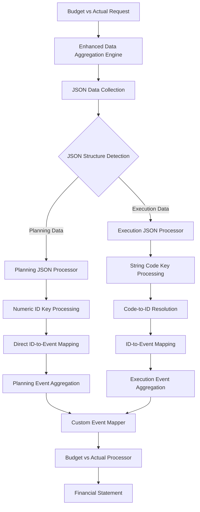

# Design Document

## Overview

This design addresses the critical JSON data structure mismatch in the Budget vs Actual statement processor where planning data fails to appear in the budget column due to different JSON structures. Both planning and execution data are stored as JSON, but planning data uses numeric activity IDs as keys while execution data uses string activity codes as keys. The current `collectQuarterlyJsonData()` method only handles execution data structure.

The solution implements **dual JSON structure processing** by enhancing the data aggregation engine to handle both planning JSON structure (numeric ID keys) and execution JSON structure (string code keys) in the same processing pipeline.

## Architecture

### Current Architecture Issues

1. **JSON Processing Logic** in `collectQuarterlyJsonData()` is designed only for execution data structure (string codes as keys)
2. **Planning Data Structure** uses numeric activity IDs as keys but the system tries to resolve them as string codes
3. **Activity Code Resolution** fails because planning JSON keys are already numeric IDs, not string codes needing resolution
4. **Event Mapping Logic** works correctly but receives incompatible data structure from planning JSON processing

### Proposed Architecture



## Components and Interfaces

### 1. Enhanced Planning Data Collector

**Purpose**: Properly collect and aggregate planning data for budget vs actual statements

```typescript
interface PlanningDataCollector {
  collectPlanningData(
    filters: DataFilters,
    eventCodes: string[]
  ): Promise<EventEntry[]>;
  
  aggregatePlanningByEvent(
    planningData: EventEntry[]
  ): Promise<Map<string, number>>;
  
  validatePlanningDataCollection(
    filters: DataFilters,
    result: EventEntry[]
  ): PlanningDataValidation;
}

interface PlanningDataValidation {
  isValid: boolean;
  totalEntries: number;
  totalAmount: number;
  eventBreakdown: Map<string, number>;
  missingEvents: string[];
  warnings: string[];
}
```

**Implementation Strategy**:
- Use proper SQL joins between schema_form_data_entries, configurable_event_mappings, and events
- Filter by entity_type = 'planning' and module_type = 'planning'
- Aggregate amounts by event code
- Provide detailed logging for debugging

### 2. Planning Data Aggregation Engine

**Purpose**: Properly aggregate planning data and provide detailed diagnostics

```typescript
interface PlanningAggregationResult {
  eventTotals: Map<string, number>;
  facilityTotals: Map<number, number>;
  periodTotals: Map<number, number>;
  metadata: AggregationMetadata & {
    planningStats: {
      totalPlanningEntries: number;
      uniqueEvents: number;
      totalPlanningAmount: number;
      eventBreakdown: Map<string, number>;
      queryExecutionTime: number;
    };
  };
}

interface PlanningDataDiagnostics {
  queryDetails: {
    sql: string;
    parameters: any[];
    executionTime: number;
    rowsReturned: number;
  };
  aggregationDetails: {
    eventsFound: string[];
    eventAmounts: Map<string, number>;
    facilitiesIncluded: number[];
  };
  validationResults: PlanningDataValidation;
}
```

**Key Methods**:
- `collectPlanningDataWithDiagnostics()`: Collect planning data with detailed logging
- `aggregatePlanningData()`: Aggregate planning data by event codes
- `validatePlanningAggregation()`: Validate aggregation results
- `generatePlanningDiagnostics()`: Provide detailed diagnostic information

### 3. Planning Data Query Builder

**Purpose**: Build optimized SQL queries for planning data collection

```typescript
interface PlanningQueryBuilder {
  buildPlanningDataQuery(
    filters: DataFilters,
    eventCodes: string[]
  ): {
    sql: string;
    parameters: any[];
    expectedColumns: string[];
  };
  
  buildEventMappingQuery(
    activityIds: number[]
  ): {
    sql: string;
    parameters: any[];
  };
}
```

**Query Strategy**:
1. **Primary Query**: Join schema_form_data_entries with configurable_event_mappings and events
2. **Filtering**: Apply project, facility, period, and entity_type filters
3. **Aggregation**: Sum amounts by event code
4. **Optimization**: Use proper indexes and query hints

### 4. Planning Data Debug Logger

**Purpose**: Provide detailed logging and diagnostics for planning data issues

```typescript
interface PlanningDataLogger {
  logQueryExecution(
    query: string,
    parameters: any[],
    executionTime: number,
    rowsReturned: number
  ): void;
  
  logAggregationResults(
    eventTotals: Map<string, number>,
    expectedEvents: string[],
    missingEvents: string[]
  ): void;
  
  logValidationResults(
    validation: PlanningDataValidation
  ): void;
  
  generateDiagnosticReport(
    filters: DataFilters,
    results: PlanningAggregationResult
  ): PlanningDataDiagnostics;
}
```

**Logging Strategy**:
- Log all SQL queries with parameters and execution times
- Log aggregation results with event breakdowns
- Log validation failures with detailed context
- Generate comprehensive diagnostic reports

## Data Models

### Planning Event Entry

```typescript
interface PlanningEventEntry extends EventEntry {
  // Original fields
  eventCode: string;
  facilityId: number;
  amount: number;
  entityType: EventType; // 'planning'
  reportingPeriodId: number;
  
  // Planning-specific fields
  activityId: number;
  activityName?: string;
  categoryId?: number;
  formDataId?: number;
}
```

### Planning Data Collection Result

```typescript
interface PlanningDataCollectionResult {
  planningEntries: PlanningEventEntry[];
  aggregatedByEvent: Map<string, number>;
  aggregatedByFacility: Map<number, number>;
  metadata: {
    totalEntries: number;
    totalAmount: number;
    uniqueEvents: number;
    facilitiesIncluded: number[];
    queryExecutionTime: number;
  };
}
```

### Planning Data Query Parameters

```typescript
interface PlanningQueryParams {
  projectId: number;
  facilityId?: number;
  reportingPeriodId: number;
  entityTypes: string[]; // ['planning']
  eventCodes?: string[];
  includeInactive?: boolean;
}
```

## Error Handling

### Planning Data Collection Failure Strategies

1. **No Planning Data Found**: Log detailed query information, check filters and entity types
2. **Event Mapping Missing**: Log missing event mappings, suggest configuration fixes
3. **Database Query Error**: Retry with exponential backoff, log full error context
4. **Aggregation Failure**: Log aggregation details, provide diagnostic information

### Error Reporting

```typescript
interface PlanningDataError {
  type: 'NO_DATA_FOUND' | 'MAPPING_MISSING' | 'QUERY_ERROR' | 'AGGREGATION_ERROR';
  context: PlanningQueryParams;
  message: string;
  queryDetails?: {
    sql: string;
    parameters: any[];
    error?: string;
  };
  suggestions?: string[];
  timestamp: Date;
}
```

### Graceful Degradation

- **Partial Data**: Continue processing with available planning data, report missing events
- **Fallback to Zero**: Use zero values for budget column if no planning data found
- **Diagnostic Reporting**: Provide detailed diagnostic information in statement metadata

## Testing Strategy

### Unit Tests

1. **Activity Code Resolution Service**
   - Test code-to-ID mapping with various contexts
   - Test cache hit/miss scenarios
   - Test error handling for invalid codes

2. **Enhanced Data Aggregation Engine**
   - Test dual-path processing with mixed data types
   - Test aggregation accuracy with resolved data
   - Test performance with large datasets

3. **Resolution Cache System**
   - Test cache operations (get, set, invalidate)
   - Test TTL expiration
   - Test memory usage limits

### Integration Tests

1. **End-to-End Budget vs Actual Generation**
   - Test with planning data only (numeric IDs)
   - Test with execution data only (string codes)
   - Test with mixed planning and execution data

2. **Database Integration**
   - Test with real dynamic_activities data
   - Test with various project/facility combinations
   - Test with missing or incomplete activity data

3. **Performance Tests**
   - Test resolution performance with 1000+ activity codes
   - Test cache performance under load
   - Test memory usage with large datasets

### Error Scenario Tests

1. **Missing Activity Codes**
   - Test behavior when execution codes don't exist in dynamic_activities
   - Test partial resolution scenarios

2. **Database Connectivity Issues**
   - Test retry logic for database failures
   - Test fallback behavior when resolution service is unavailable

3. **Cache Corruption**
   - Test cache invalidation and rebuilding
   - Test behavior with corrupted cache entries

## Implementation Phases

### Phase 1: Enhanced Planning Data Collection
- Implement improved planning data collection queries
- Add proper joins between schema_form_data_entries, configurable_event_mappings, and events
- Create comprehensive error handling and logging

### Phase 2: Planning Data Aggregation Engine
- Modify existing aggregation to properly handle planning data
- Implement planning-specific aggregation logic
- Add detailed diagnostics and validation

### Phase 3: Integration and Testing
- Integrate enhanced planning collection with budget vs actual processor
- Add comprehensive logging and monitoring
- Perform end-to-end testing with real planning data

### Phase 4: Performance Optimization and Monitoring
- Optimize planning data queries with proper indexing
- Add performance monitoring and alerting
- Implement diagnostic reporting for troubleshooting

## Performance Considerations

### Resolution Performance
- **Target**: Resolve 1000 activity codes in < 2 seconds
- **Cache Hit Rate**: Target 90%+ for repeated requests
- **Memory Usage**: Limit cache to 100MB maximum

### Database Impact
- **Query Optimization**: Use indexed lookups on dynamic_activities
- **Connection Pooling**: Reuse database connections for resolution queries
- **Batch Processing**: Resolve multiple codes in single database query

### Monitoring Metrics
- Resolution success rate
- Cache hit rate
- Average resolution time
- Failed resolution codes
- Memory usage trends