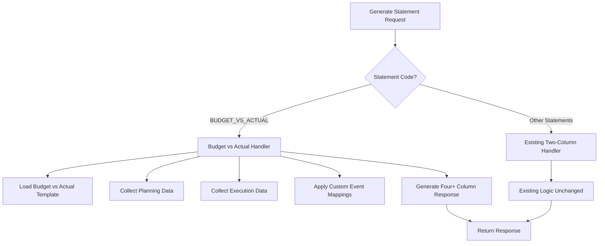
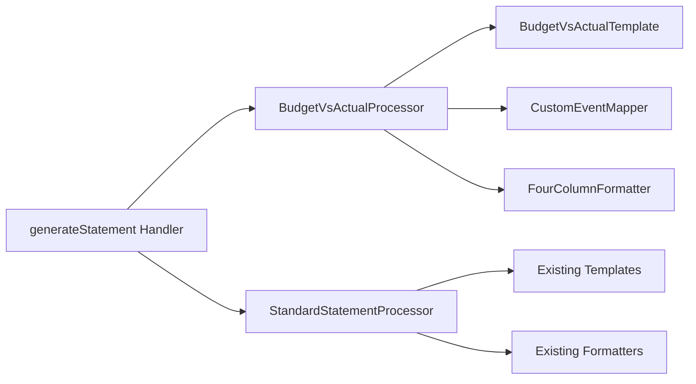

# Design Document

## Overview

This design implements a specialized Budget vs Actual statement generator that produces a four+ column format (Description, Note, Revised Budget, Actual, Variance, Performance %) while maintaining backward compatibility with existing two-column financial statements. The solution uses conditional logic to apply Budget vs Actual specific processing only when needed, leaving other statement types unchanged.

## Architecture

### High-Level Flow



### Component Interaction



## Components and Interfaces

### 1. BudgetVsActualProcessor

**Purpose:** Handles the specialized logic for Budget vs Actual statement generation.

**Interface:**
```typescript
interface BudgetVsActualProcessor {
  generateStatement(
    template: StatementTemplate,
    planningData: AggregatedEventData,
    executionData: AggregatedEventData,
    options: GenerationOptions
  ): Promise<BudgetVsActualStatement>;
}
```

**Key Methods:**
- `processLineWithCustomMapping()`: Handles lines with complex event mappings
- `calculatePerformancePercentage()`: Computes (Actual / Budget) * 100
- `formatBudgetVsActualLine()`: Creates the four+ column line structure

### 2. CustomEventMapper

**Purpose:** Manages the complex event mappings where budget and actual columns use different event codes.

**Interface:**
```typescript
interface CustomEventMapper {
  getEventMapping(lineCode: string): BudgetVsActualMapping | null;
  applyMapping(
    mapping: BudgetVsActualMapping,
    planningData: Map<string, number>,
    executionData: Map<string, number>
  ): { budgetAmount: number; actualAmount: number };
}

interface BudgetVsActualMapping {
  lineCode: string;
  budgetEvents: string[];    // e.g., ['GOODS_SERVICES_PLANNING']
  actualEvents: string[];    // e.g., ['TRANSFERS_PUBLIC_ENTITIES']
  note?: number;
}
```

### 3. Enhanced Template Structure

**Purpose:** Extends the existing template system to support Budget vs Actual specific configurations.

**Template Enhancement:**
```typescript
interface BudgetVsActualTemplateLine extends TemplateLine {
  metadata: {
    note?: number;
    budgetVsActualMapping?: {
      budgetEvents: string[];
      actualEvents: string[];
    };
    statementType: 'BUDGET_VS_ACTUAL';
  };
}
```

### 4. Response Type Extensions

**Purpose:** Extends existing response types to support the four+ column structure while maintaining backward compatibility.

**New Response Types:**
```typescript
interface BudgetVsActualLine {
  id: string;
  description: string;
  note?: number;
  revisedBudget: number;        // Column A
  actual: number;               // Column B  
  variance: number;             // A - B
  performancePercentage?: number; // (B / A) * 100
  formatting: LineFormatting;
  metadata: LineMetadata;
}

interface BudgetVsActualStatement {
  statementCode: 'BUDGET_VS_ACTUAL';
  statementName: string;
  reportingPeriod: PeriodInfo;
  facility?: FacilityInfo;
  generatedAt: string;
  lines: BudgetVsActualLine[];
  totals: Record<string, { budget: number; actual: number; variance: number }>;
  metadata: StatementMetadata;
}
```

## Data Models

### 1. Event Mapping Configuration

The system uses metadata-driven event mappings stored in the template:

```typescript
const budgetVsActualMappings: Record<string, BudgetVsActualMapping> = {
  'TRANSFERS_PUBLIC': {
    lineCode: 'TRANSFERS_PUBLIC',
    budgetEvents: ['GOODS_SERVICES_PLANNING'],
    actualEvents: ['TRANSFERS_PUBLIC_ENTITIES'],
    note: 4
  },
  'GOODS_SERVICES': {
    lineCode: 'GOODS_SERVICES', 
    budgetEvents: ['GOODS_SERVICES_PLANNING'],
    actualEvents: ['GOODS_SERVICES'],
    note: 23
  }
  // ... other custom mappings
};
```

### 2. Enhanced Template Data

```typescript
export const budgetVsActualTemplate: TemplateLine[] = [
  {
    lineItem: '1. RECEIPTS',
    lineCode: 'RECEIPTS_HEADER',
    eventCodes: [],
    displayOrder: 1,
    level: 1,
    isSubtotalLine: true,
    formatRules: { bold: true },
    metadata: { statementType: 'BUDGET_VS_ACTUAL' }
  },
  {
    lineItem: 'Tax revenue',
    lineCode: 'TAX_REVENUE',
    eventCodes: ['TAX_REVENUE'], // Standard mapping
    displayOrder: 2,
    level: 2,
    metadata: { note: 1, statementType: 'BUDGET_VS_ACTUAL' }
  },
  {
    lineItem: 'Transfers from public entities',
    lineCode: 'TRANSFERS_PUBLIC',
    eventCodes: [], // Empty - uses custom mapping
    displayOrder: 5,
    level: 2,
    metadata: { 
      note: 4,
      statementType: 'BUDGET_VS_ACTUAL',
      budgetVsActualMapping: {
        budgetEvents: ['GOODS_SERVICES_PLANNING'],
        actualEvents: ['TRANSFERS_PUBLIC_ENTITIES']
      }
    }
  }
  // ... rest of template
];
```

## Error Handling

### 1. Missing Event Data
- **Strategy:** Display zero values with warnings
- **Implementation:** Graceful fallback with detailed logging
- **User Experience:** Clear indication of missing data in validation results

### 2. Invalid Event Mappings
- **Strategy:** Fall back to standard template mappings
- **Implementation:** Validation during template loading
- **User Experience:** Warning messages in statement metadata

### 3. Division by Zero in Performance %
- **Strategy:** Display "-" when budget is zero
- **Implementation:** Safe division with null checks
- **User Experience:** Consistent formatting across all scenarios

### 4. Template Configuration Errors
- **Strategy:** Fail fast with clear error messages
- **Implementation:** Template validation during system startup
- **User Experience:** Detailed error context for administrators

## Testing Strategy

### 1. Unit Tests
- **BudgetVsActualProcessor:** Test line processing with various event mapping scenarios
- **CustomEventMapper:** Test mapping resolution and fallback behavior
- **Performance Calculation:** Test percentage calculations including edge cases
- **Template Validation:** Test template loading and validation logic

### 2. Integration Tests
- **End-to-End Statement Generation:** Test complete Budget vs Actual statement generation
- **Event Data Collection:** Test planning and execution data aggregation
- **Response Formatting:** Test four+ column response structure
- **Backward Compatibility:** Ensure other statement types remain unaffected

### 3. Data Scenarios
- **Complete Data:** Test with full planning and execution data
- **Missing Planning Data:** Test graceful handling of missing budget data
- **Missing Execution Data:** Test graceful handling of missing actual data
- **Complex Mappings:** Test custom event mappings with multiple events per line

### 4. Performance Tests
- **Large Datasets:** Test with realistic data volumes
- **Multiple Facilities:** Test aggregation across facilities
- **Complex Formulas:** Test computed line performance

## Implementation Phases

### Phase 1: Core Infrastructure
1. Create BudgetVsActualProcessor class
2. Implement CustomEventMapper
3. Extend response types with union types for backward compatibility
4. Update template structure with Budget vs Actual metadata

### Phase 2: Statement Generation Logic
1. Implement four+ column line processing
2. Add custom event mapping resolution
3. Implement performance percentage calculations
4. Add specialized formatting for Budget vs Actual lines

### Phase 3: Template and Data Updates
1. Update budgetVsActualTemplate with correct structure and mappings
2. Ensure all required events exist in database
3. Add validation for Budget vs Actual specific requirements
4. Implement error handling and fallback mechanisms

### Phase 4: Integration and Testing
1. Integrate with existing generateStatement handler
2. Add conditional logic to route Budget vs Actual requests
3. Comprehensive testing of all scenarios
4. Performance optimization and validation

## Backward Compatibility

### Existing Statements Unchanged
- REV_EXP, ASSETS_LIAB, CASH_FLOW, NET_ASSETS_CHANGES continue using existing logic
- No changes to existing response types or database schema
- Existing templates and event mappings remain unmodified

### Response Type Compatibility
- Use union types to support both existing and new response formats
- Maintain existing API contracts for non-Budget vs Actual statements
- Gradual migration path for clients that need Budget vs Actual support

### Database Schema
- Leverage existing `metadata` field in statement_templates for custom mappings
- No breaking changes to existing tables or relationships
- Optional enhancements that don't affect existing functionality