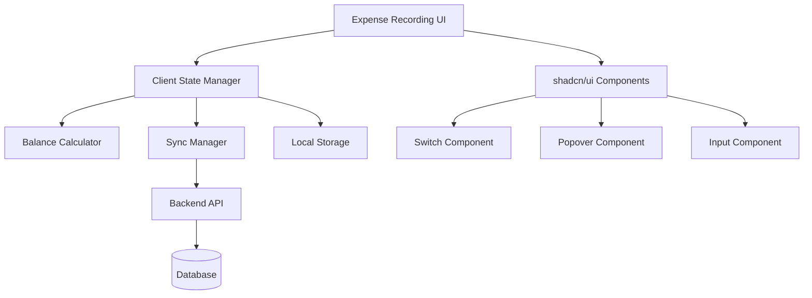

# Design Document

## Overview

The execution expense recording feature introduces a client-side accounting system that provides real-time balance calculations and an intuitive payment status interface. The design leverages React state management for instant feedback while maintaining the backend as the authoritative data source. The system integrates seamlessly with the existing BMS execution module and uses shadcn/ui components for consistent user experience.

## Architecture

### High-Level Architecture



### Component Architecture

The system follows a modular architecture with clear separation of concerns:

- **UI Layer**: React components using shadcn/ui for consistent design
- **State Layer**: Zustand store for client-side state management
- **Calculation Layer**: Pure functions for balance computations
- **Sync Layer**: API integration with conflict resolution
- **Storage Layer**: Local persistence for offline capability

## Components and Interfaces

### Core Components

#### 1. ExpenseRecordingForm
Main container component that orchestrates expense entry workflow.

```typescript
interface ExpenseRecordingFormProps {
  initialData?: ExpenseEntry[]
  onSave: (data: ExpenseData) => Promise<void>
  onAutoSave?: (data: ExpenseData) => Promise<void>
}
```

#### 2. PaymentStatusSelector
Interactive component for selecting payment status with shadcn/ui components.

```typescript
interface PaymentStatusSelectorProps {
  expense: ExpenseEntry
  onChange: (status: PaymentStatus, amount?: number) => void
  disabled?: boolean
}
```

#### 3. BalanceDisplay
Real-time display of financial balances with visual indicators.

```typescript
interface BalanceDisplayProps {
  cashAtBank: number
  payables: PayableBreakdown
  totalExpenses: number
  showChanges?: boolean
}
```

#### 4. ExpenseEntryRow
Individual expense entry with integrated payment controls.

```typescript
interface ExpenseEntryRowProps {
  expense: ExpenseEntry
  onUpdate: (expense: ExpenseEntry) => void
  onDelete: (id: string) => void
}
```

### State Management Interfaces

#### ExpenseStore
Zustand store managing all client-side expense data and calculations.

```typescript
interface ExpenseStore {
  // State
  expenses: ExpenseEntry[]
  balances: FinancialBalances
  syncStatus: SyncStatus
  
  // Actions
  addExpense: (expense: Omit<ExpenseEntry, 'id'>) => void
  updateExpense: (id: string, updates: Partial<ExpenseEntry>) => void
  deleteExpense: (id: string) => void
  updatePaymentStatus: (id: string, status: PaymentStatus, amount?: number) => void
  
  // Sync operations
  saveToServer: () => Promise<void>
  loadFromServer: () => Promise<void>
  enableAutoSave: (interval: number) => void
}
```

## Data Models

### Core Data Types

```typescript
interface ExpenseEntry {
  id: string
  categoryId: string
  activityId: string
  description: string
  amount: number
  paymentStatus: PaymentStatus
  amountPaid: number
  dateCreated: Date
  dateModified: Date
}

type PaymentStatus = 'paid' | 'unpaid' | 'partial'

interface FinancialBalances {
  cashAtBank: number
  payables: PayableBreakdown
  totalExpenses: number
  initialCash: number
}

interface PayableBreakdown {
  salaries: number
  maintenance: number
  supplies: number
  transportation: number
  other: number
}

interface SyncStatus {
  isOnline: boolean
  lastSync: Date | null
  pendingChanges: boolean
  syncInProgress: boolean
}
```

### API Data Transfer Objects

```typescript
interface ExpenseDataPayload {
  expenses: ExpenseEntry[]
  balances: FinancialBalances
  metadata: {
    lastModified: Date
    version: number
  }
}

interface SyncResponse {
  success: boolean
  data?: ExpenseDataPayload
  conflicts?: ConflictResolution[]
  errors?: ValidationError[]
}
```

## Error Handling

### Client-Side Error Management

#### Validation Errors
- Real-time validation of expense amounts
- Payment amount validation (cannot exceed total expense)
- Balance validation (cash at bank cannot go negative)

#### Network Errors
- Graceful handling of connectivity issues
- Automatic retry with exponential backoff
- Queue pending operations for later sync

#### Conflict Resolution
- Server-wins strategy for data conflicts
- User notification of overridden changes
- Option to review and reapply local changes

### Error Recovery Strategies

```typescript
interface ErrorHandler {
  handleValidationError: (error: ValidationError) => void
  handleNetworkError: (error: NetworkError) => void
  handleSyncConflict: (conflict: ConflictResolution) => void
  recoverFromError: (error: AppError) => Promise<void>
}
```

## Testing Strategy

### Unit Testing
- **Balance Calculation Functions**: Test all calculation scenarios including edge cases
- **Payment Status Logic**: Verify correct state transitions and amount handling
- **Validation Functions**: Test input validation and error conditions
- **State Management**: Test Zustand store actions and state updates

### Integration Testing
- **Component Integration**: Test interaction between UI components and state
- **API Integration**: Test sync operations and error handling
- **Local Storage**: Test persistence and recovery scenarios

### End-to-End Testing
- **Complete Expense Flow**: Test full expense entry and payment workflow
- **Offline Scenarios**: Test functionality without network connectivity
- **Multi-Session Sync**: Test data consistency across browser sessions

### Performance Testing
- **Large Dataset Handling**: Test with hundreds of expense entries
- **Real-time Calculation Performance**: Measure calculation speed with complex data
- **Memory Usage**: Monitor memory consumption during extended use

## Implementation Phases

### Phase 1: Core Infrastructure
1. Set up Zustand store with basic expense management
2. Implement balance calculation functions
3. Create basic UI components with shadcn/ui
4. Add local storage persistence

### Phase 2: Interactive UI
1. Implement PaymentStatusSelector with Switch and Popover
2. Add real-time balance display
3. Create expense entry form with validation
4. Integrate payment status workflow

### Phase 3: Sync and Persistence
1. Implement API integration for server sync
2. Add conflict resolution logic
3. Create auto-save functionality
4. Handle offline scenarios

### Phase 4: Polish and Optimization
1. Add comprehensive error handling
2. Implement performance optimizations
3. Add accessibility features
4. Create comprehensive test suite

## Security Considerations

### Data Validation
- Client-side validation for immediate feedback
- Server-side validation as authoritative source
- Sanitization of all user inputs

### State Protection
- Immutable state updates to prevent corruption
- Validation of state transitions
- Protection against malicious data injection

### API Security
- Authentication tokens for all API calls
- Request rate limiting
- Data encryption in transit

## Performance Optimizations

### Client-Side Optimizations
- Memoization of expensive calculations
- Debounced auto-save to reduce API calls
- Virtual scrolling for large expense lists
- Lazy loading of non-critical components

### Network Optimizations
- Batch API requests where possible
- Compression of sync payloads
- Intelligent sync scheduling
- Offline-first architecture with sync queuing

## Accessibility Features

### Keyboard Navigation
- Full keyboard accessibility for all interactive elements
- Logical tab order through expense entry workflow
- Keyboard shortcuts for common actions

### Screen Reader Support
- Proper ARIA labels for all form controls
- Descriptive text for balance changes
- Status announcements for sync operations

### Visual Accessibility
- High contrast mode support
- Scalable text and UI elements
- Clear visual indicators for payment status