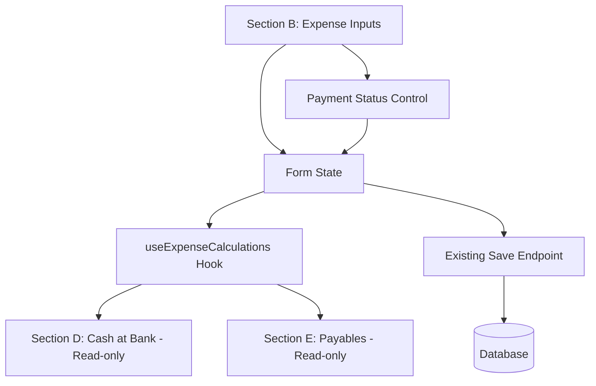

# Design Document

## Overview

This feature adds payment status tracking to the execution form's expenditure section. The design is intentionally minimal: extend the existing form state to include payment information, add a simple UI control (Switch + Popover) next to each expense input, and create a calculation hook that computes Cash at Bank and Payables in real-time. No backend changes are required—computed values are saved using the existing endpoint.

## Architecture

### High-Level Architecture



### Design Principles

1. **Minimal State Extension**: Add only `paymentStatus` and `amountPaid` to existing expense data structure
2. **Single Source of Truth**: All calculations derive from Section B payment data
3. **Real-time Computation**: Use React hooks (useMemo) for instant updates
4. **No Backend Changes**: Save computed values using existing endpoint
5. **Progressive Enhancement**: Existing forms without payment data continue to work

## Components and Interfaces

### 1. Payment Status Control Component

A compact UI control that combines Switch, Popover, and Input components from shadcn/ui.

```typescript
interface PaymentStatusControlProps {
  expenseCode: string
  amount: number
  paymentStatus: "paid" | "unpaid" | "partial"
  amountPaid: number
  onChange: (status: "paid" | "unpaid" | "partial", amountPaid: number) => void
  disabled?: boolean
}
```

**Behavior:**
- Displays a Switch component (Paid/Unpaid toggle)
- When clicked, shows a Popover with three options:
  - "Fully Paid" button → sets status to "paid", amountPaid = amount
  - "Unpaid" button → sets status to "unpaid", amountPaid = 0
  - "Partially Paid" section with Input → sets status to "partial", amountPaid = user input
- Validates partial amount doesn't exceed total amount
- Provides visual feedback for current payment status

### 2. Expense Calculations Hook

A custom hook that computes Cash at Bank and Payables from expense payment data.

```typescript
interface UseExpenseCalculationsParams {
  formData: Record<string, ExpenseFormData>
  openingBalance: number
  activities: ExecutionActivities
}

interface UseExpenseCalculationsReturn {
  cashAtBank: number
  payables: Record<string, number>
  totalExpenses: number
  totalPaid: number
  totalUnpaid: number
}

function useExpenseCalculations(params: UseExpenseCalculationsParams): UseExpenseCalculationsReturn
```

**Calculation Logic:**

```typescript
// 1. Get opening balance from Section A-2
const openingBalance = formData["HIV_EXEC_HOSPITAL_A_2"]?.amount || 0

// 2. Calculate totals from Section B expenses
const expenses = getSectionBExpenses(formData, activities)
const totalExpenses = expenses.reduce((sum, e) => sum + e.amount, 0)
const totalPaid = expenses.reduce((sum, e) => sum + e.amountPaid, 0)
const totalUnpaid = totalExpenses - totalPaid

// 3. Compute Cash at Bank
const cashAtBank = openingBalance - totalPaid

// 4. Compute Payables by category
const payables = computePayablesByCategory(expenses, activities)

return { cashAtBank, payables, totalExpenses, totalPaid, totalUnpaid }
```

## Data Models

### Extended Form Data Structure

**Current structure:**
```typescript
formData = {
  "HIV_EXEC_HOSPITAL_B_B-01_1": {
    amount: 12000
  }
}
```

**Extended structure:**
```typescript
formData = {
  "HIV_EXEC_HOSPITAL_B_B-01_1": {
    amount: 12000,
    paymentStatus: "paid",
    amountPaid: 12000
  },
  "HIV_EXEC_HOSPITAL_B_B-01_2": {
    amount: 18000,
    paymentStatus: "unpaid",
    amountPaid: 0
  },
  "HIV_EXEC_HOSPITAL_B_B-02_1": {
    amount: 8000,
    paymentStatus: "partial",
    amountPaid: 5000
  }
}
```

### Expense to Payable Mapping

The mapping is derived from seeded data. Each expense item maps to a specific payable category:

```typescript
const EXPENSE_TO_PAYABLE_MAP = {
  // B-01: Human Resources → payable 1: salaries
  "HIV_EXEC_HOSPITAL_B_B-01_1": "HIV_EXEC_HOSPITAL_E_1", // Lab Tech → salaries
  "HIV_EXEC_HOSPITAL_B_B-01_2": "HIV_EXEC_HOSPITAL_E_1", // Nurse → salaries
  
  // B-02: M&E → payable 2 & 3
  "HIV_EXEC_HOSPITAL_B_B-02_1": "HIV_EXEC_HOSPITAL_E_2", // Supervision → supervision
  "HIV_EXEC_HOSPITAL_B_B-02_2": "HIV_EXEC_HOSPITAL_E_3", // Meetings → meetings
  
  // B-03: Living Support → payable 4, 5, 6
  "HIV_EXEC_HOSPITAL_B_B-03_1": "HIV_EXEC_HOSPITAL_E_4", // Sample transport
  "HIV_EXEC_HOSPITAL_B_B-03_2": "HIV_EXEC_HOSPITAL_E_5", // Home visits
  "HIV_EXEC_HOSPITAL_B_B-03_3": "HIV_EXEC_HOSPITAL_E_6", // Travel surveillance
  
  // B-04: Overheads → payable 7, 8, 9, 10
  "HIV_EXEC_HOSPITAL_B_B-04_1": "HIV_EXEC_HOSPITAL_E_7", // Infrastructure
  "HIV_EXEC_HOSPITAL_B_B-04_2": "HIV_EXEC_HOSPITAL_E_8", // Supplies
  "HIV_EXEC_HOSPITAL_B_B-04_3": "HIV_EXEC_HOSPITAL_E_9", // Transport reporting
  "HIV_EXEC_HOSPITAL_B_B-04_4": "HIV_EXEC_HOSPITAL_E_10", // Bank charges
  
  // B-05: Transfers → no payable (always paid)
  "HIV_EXEC_HOSPITAL_B_B-05_1": null, // Transfer to RBC
  
  // VAT refund payable (E_11) - special case, not mapped from expenses
}
```

**Note:** This mapping should be generated dynamically from the seeded data structure, not hardcoded.

## Implementation Details

### 1. Form State Management

Extend the existing `useExecutionForm` hook to handle payment data:

```typescript
// In useExecutionForm hook
const updateExpensePayment = useCallback((code: string, status: PaymentStatus, amountPaid: number) => {
  setFormData(prev => ({
    ...prev,
    [code]: {
      ...prev[code],
      paymentStatus: status,
      amountPaid: amountPaid
    }
  }))
}, [])
```

### 2. Real-time Calculation Integration

```typescript
// In the form component
const { cashAtBank, payables } = useExpenseCalculations({
  formData,
  openingBalance: formData["HIV_EXEC_HOSPITAL_A_2"]?.amount || 0,
  activities
})

// Auto-update Section D and E with computed values
useEffect(() => {
  // Update Cash at Bank (D-1)
  updateFormData("HIV_EXEC_HOSPITAL_D_1", { amount: cashAtBank })
  
  // Update each payable category
  Object.entries(payables).forEach(([code, amount]) => {
    updateFormData(code, { amount })
  })
}, [cashAtBank, payables])
```

### 3. UI Integration in Section B

Modify the expense row rendering to include the payment control:

```typescript
// In the Section B rendering logic
{sectionB.subCategories[subCatCode].items.map(item => (
  <div key={item.code} className="flex items-center gap-2">
    <span className="flex-1">{item.name}</span>
    
    {/* Existing amount input */}
    <Input
      type="number"
      value={formData[item.code]?.amount || 0}
      onChange={(e) => updateAmount(item.code, Number(e.target.value))}
      className="w-32"
    />
    
    {/* NEW: Payment status control */}
    <PaymentStatusControl
      expenseCode={item.code}
      amount={formData[item.code]?.amount || 0}
      paymentStatus={formData[item.code]?.paymentStatus || "unpaid"}
      amountPaid={formData[item.code]?.amountPaid || 0}
      onChange={(status, amountPaid) => 
        updateExpensePayment(item.code, status, amountPaid)
      }
    />
  </div>
))}
```

### 4. Read-only Fields in Section D & E

```typescript
// Section D: Cash at Bank
<Input
  type="number"
  value={cashAtBank}
  disabled={true}
  className="bg-gray-50 cursor-not-allowed"
  title="Auto-calculated from paid expenses"
/>

// Section E: Payables
{sectionE.items.map(item => (
  <Input
    key={item.code}
    type="number"
    value={payables[item.code] || 0}
    disabled={true}
    className="bg-gray-50 cursor-not-allowed"
    title="Auto-calculated from unpaid expenses"
  />
))}
```

## Error Handling

### Validation Rules

1. **Partial Payment Validation**:
   - Amount paid cannot exceed total expense amount
   - Amount paid must be greater than 0 for partial status
   - Show inline error message if validation fails

2. **Opening Balance Validation**:
   - Warn if total paid exceeds opening balance (negative cash)
   - Allow saving but show warning indicator

3. **Data Consistency**:
   - If payment status is missing, default to "unpaid" with amountPaid = 0
   - If amountPaid is missing but status is "paid", set amountPaid = amount

### Error Messages

```typescript
const VALIDATION_MESSAGES = {
  PARTIAL_EXCEEDS_TOTAL: "Paid amount cannot exceed total expense",
  PARTIAL_ZERO: "Paid amount must be greater than 0 for partial payment",
  NEGATIVE_CASH: "Warning: Total paid exceeds opening balance (negative cash position)",
  INVALID_AMOUNT: "Please enter a valid amount"
}
```

## Testing Strategy

### Unit Tests

1. **useExpenseCalculations Hook**:
   - Test cash at bank calculation with various payment scenarios
   - Test payables calculation and category mapping
   - Test edge cases (no expenses, all paid, all unpaid, mixed)

2. **PaymentStatusControl Component**:
   - Test switch toggle behavior
   - Test popover display and option selection
   - Test partial payment input validation
   - Test visual indicators for each status

### Integration Tests

1. **Form Integration**:
   - Test payment status changes update calculations
   - Test Section D and E fields update in real-time
   - Test form save includes payment data
   - Test form load restores payment status

### Manual Testing Checklist

1. Enter expenses and mark as paid → verify cash decreases
2. Mark expenses as unpaid → verify payables increase
3. Enter partial payment → verify split between cash and payables
4. Change payment status → verify immediate recalculation
5. Save and reload form → verify payment data persists
6. Test with existing data (no payment info) → verify defaults work

## Performance Considerations

### Optimization Strategies

1. **Memoization**:
   - Use `useMemo` for expense calculations to avoid unnecessary recomputation
   - Memoize expense-to-payable mapping lookup

2. **Debouncing**:
   - Debounce partial payment input to reduce calculation frequency
   - Use 300ms debounce for amount input changes

3. **Selective Updates**:
   - Only update affected payable categories when expense changes
   - Avoid full form re-render on payment status change

```typescript
const { cashAtBank, payables } = useMemo(() => 
  calculateFinancials(formData, openingBalance, activities),
  [formData, openingBalance, activities]
)
```

## Accessibility

### Keyboard Navigation

- Tab order: Amount Input → Payment Toggle → (if popover open) Payment Options
- Enter key on toggle opens popover
- Arrow keys navigate popover options
- Escape closes popover

### Screen Reader Support

```typescript
<Switch
  aria-label={`Payment status for ${expenseName}`}
  aria-checked={paymentStatus === "paid"}
  aria-describedby={`${expenseCode}-payment-description`}
/>

<span id={`${expenseCode}-payment-description`} className="sr-only">
  {paymentStatus === "paid" && "Fully paid"}
  {paymentStatus === "unpaid" && "Not paid"}
  {paymentStatus === "partial" && `Partially paid: ${amountPaid} of ${amount}`}
</span>
```

### Visual Indicators

- Paid: Green checkmark icon
- Unpaid: Red X icon or empty circle
- Partial: Orange dash icon with amount indicator
- Disabled fields: Gray background with lock icon

## Migration Strategy

### Backward Compatibility

Existing execution records without payment data will:
1. Default all expenses to `paymentStatus: "unpaid"`, `amountPaid: 0`
2. Keep existing Section D and E values as-is (manual entries)
3. Show a banner: "Enable payment tracking to auto-calculate cash and payables"

### Opt-in Approach

1. Add a checkbox at the top of Section B: "Enable automatic payment tracking"
2. When enabled, show payment controls and lock D/E fields
3. When disabled, hide payment controls and allow manual D/E entry
4. Save the preference with the execution record

This allows gradual adoption without breaking existing workflows.
