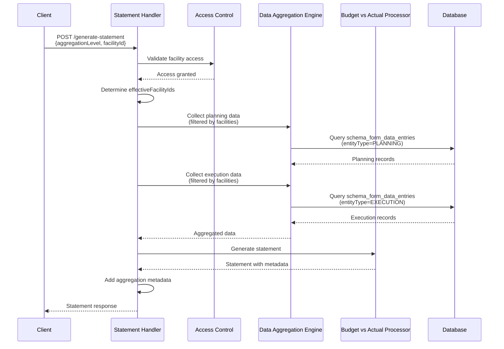

# Design Document

## Overview

This design extends the existing Budget vs Actual financial statement generation system to support flexible aggregation levels. The enhancement enables single-facility statements while maintaining backward compatibility with district-level aggregation. The design leverages the existing data collection and aggregation infrastructure, requiring minimal changes to the core statement engine.

## Architecture

### System Context

The facility-level budget statement feature integrates with the existing financial statement generation system:

```
┌─────────────────────────────────────────────────────────────┐
│                    API Layer                                 │
│  POST /api/financial-reports/generate-statement             │
│  - Enhanced request schema with aggregationLevel            │
│  - Enhanced response with aggregationMetadata               │
└─────────────────────────────────────────────────────────────┘
                            ↓
┌─────────────────────────────────────────────────────────────┐
│              Statement Generation Handler                    │
│  - Parse aggregationLevel parameter                         │
│  - Determine effectiveFacilityIds based on level            │
│  - Validate facility access                                 │
└─────────────────────────────────────────────────────────────┘
                            ↓
┌─────────────────────────────────────────────────────────────┐
│              Data Aggregation Engine                        │
│  - Collect planning data (filtered by facilities)          │
│  - Collect execution data (filtered by facilities)         │
│  - Aggregate by event codes                                │
└─────────────────────────────────────────────────────────────┘
                            ↓
┌─────────────────────────────────────────────────────────────┐
│         Budget vs Actual Processor                          │
│  - Calculate variances                                      │
│  - Generate statement lines                                 │
│  - Add aggregation metadata                                 │
└─────────────────────────────────────────────────────────────┘
```

### Component Interaction



## Components and Interfaces

### 1. Enhanced API Request Schema

**Location:** `apps/server/src/api/routes/financial-reports/financial-reports.types.ts`

```typescript
export const generateStatementRequestSchema = z.object({
  statementCode: statementCodeEnum,
  reportingPeriodId: z.number().int().positive(),
  projectType: z.string(),
  
  // NEW: Aggregation level control
  aggregationLevel: z.enum(['FACILITY', 'DISTRICT', 'PROVINCE'])
    .optional()
    .default('DISTRICT')
    .describe('Organizational level for data aggregation'),
  
  // ENHANCED: Now required when aggregationLevel is FACILITY
  facilityId: z.number().int().positive()
    .optional()
    .describe('Specific facility ID for facility-level statements'),
  
  // NEW: Optional facility breakdown
  includeFacilityBreakdown: z.boolean()
    .optional()
    .default(false)
    .describe('Include per-facility details in aggregated statements'),
  
  // Existing fields
  includeComparatives: z.boolean().optional().default(true),
  customMappings: z.record(z.string(), z.any()).optional().default({})
});
```

### 2. Enhanced Response Schema

**Location:** `apps/server/src/api/routes/financial-reports/financial-reports.types.ts`

```typescript
// Aggregation metadata schema
export const aggregationMetadataSchema = z.object({
  level: z.enum(['FACILITY', 'DISTRICT', 'PROVINCE']),
  
  // Facility-level metadata
  facilityId: z.number().optional(),
  facilityName: z.string().optional(),
  facilityType: z.string().optional(),
  
  // District-level metadata
  districtId: z.number().optional(),
  districtName: z.string().optional(),
  
  // Province-level metadata
  provinceId: z.number().optional(),
  provinceName: z.string().optional(),
  
  // Common metadata
  facilitiesIncluded: z.array(z.number()),
  totalFacilities: z.number(),
  dataCompleteness: z.object({
    facilitiesWithPlanning: z.number(),
    facilitiesWithExecution: z.number(),
    facilitiesWithBoth: z.number()
  })
});

// Facility breakdown schema
export const facilityBreakdownItemSchema = z.object({
  facilityId: z.number(),
  facilityName: z.string(),
  facilityType: z.string(),
  budget: z.number(),
  actual: z.number(),
  variance: z.number(),
  variancePercentage: z.number(),
  isFavorable: z.boolean()
});

// Enhanced statement response
export const generateStatementResponseSchema = z.object({
  statement: z.union([
    standardStatementSchema,
    budgetVsActualStatementSchema
  ]),
  validation: validationResultsSchema,
  performance: performanceMetricsSchema,
  
  // NEW: Aggregation metadata
  aggregationMetadata: aggregationMetadataSchema.optional(),
  
  // NEW: Optional facility breakdown
  facilityBreakdown: z.array(facilityBreakdownItemSchema).optional()
});
```

### 3. Aggregation Level Determination Logic

**Location:** `apps/server/src/api/routes/financial-reports/financial-reports.handlers.ts`

```typescript
/**
 * Determine effective facility IDs based on aggregation level
 */
function determineEffectiveFacilityIds(
  aggregationLevel: 'FACILITY' | 'DISTRICT' | 'PROVINCE',
  facilityId: number | undefined,
  userContext: UserContext
): number[] {
  
  switch (aggregationLevel) {
    case 'FACILITY':
      // Single facility mode
      if (!facilityId) {
        throw new HTTPException(400, { 
          message: 'facilityId is required when aggregationLevel is FACILITY' 
        });
      }
      
      // Validate access
      if (!userContext.accessibleFacilityIds.includes(facilityId)) {
        throw new HTTPException(403, { 
          message: 'Access denied to facility' 
        });
      }
      
      return [facilityId];
    
    case 'DISTRICT':
      // District aggregation mode (current behavior)
      return userContext.accessibleFacilityIds;
    
    case 'PROVINCE':
      // Province aggregation mode
      // This would require fetching all facilities in the user's province
      return getProvinceFacilityIds(userContext);
    
    default:
      throw new HTTPException(400, { 
        message: `Invalid aggregation level: ${aggregationLevel}` 
      });
  }
}
```

### 4. Aggregation Metadata Builder

**Location:** `apps/server/src/api/routes/financial-reports/financial-reports.handlers.ts`

```typescript
/**
 * Build aggregation metadata for the response
 */
async function buildAggregationMetadata(
  aggregationLevel: 'FACILITY' | 'DISTRICT' | 'PROVINCE',
  effectiveFacilityIds: number[],
  planningData: AggregatedEventData,
  executionData: AggregatedEventData,
  db: Database
): Promise<AggregationMetadata> {
  
  const metadata: AggregationMetadata = {
    level: aggregationLevel,
    facilitiesIncluded: effectiveFacilityIds,
    totalFacilities: effectiveFacilityIds.length,
    dataCompleteness: {
      facilitiesWithPlanning: 0,
      facilitiesWithExecution: 0,
      facilitiesWithBoth: 0
    }
  };
  
  // Calculate data completeness
  const facilitiesWithPlanning = new Set<number>();
  const facilitiesWithExecution = new Set<number>();
  
  // Analyze planning data
  for (const facilityId of effectiveFacilityIds) {
    const hasPlanningData = planningData.facilityTotals.get(facilityId) > 0;
    if (hasPlanningData) {
      facilitiesWithPlanning.add(facilityId);
    }
  }
  
  // Analyze execution data
  for (const facilityId of effectiveFacilityIds) {
    const hasExecutionData = executionData.facilityTotals.get(facilityId) > 0;
    if (hasExecutionData) {
      facilitiesWithExecution.add(facilityId);
    }
  }
  
  metadata.dataCompleteness.facilitiesWithPlanning = facilitiesWithPlanning.size;
  metadata.dataCompleteness.facilitiesWithExecution = facilitiesWithExecution.size;
  metadata.dataCompleteness.facilitiesWithBoth = 
    [...facilitiesWithPlanning].filter(id => facilitiesWithExecution.has(id)).length;
  
  // Add level-specific metadata
  if (aggregationLevel === 'FACILITY') {
    const facilityId = effectiveFacilityIds[0];
    const facility = await db.query.facilities.findFirst({
      where: eq(facilities.id, facilityId)
    });
    
    if (facility) {
      metadata.facilityId = facility.id;
      metadata.facilityName = facility.name;
      metadata.facilityType = facility.facilityType;
    }
  } else if (aggregationLevel === 'DISTRICT') {
    // Get district info from user context or first facility
    const facility = await db.query.facilities.findFirst({
      where: eq(facilities.id, effectiveFacilityIds[0]),
      with: { district: true }
    });
    
    if (facility?.district) {
      metadata.districtId = facility.district.id;
      metadata.districtName = facility.district.name;
    }
  } else if (aggregationLevel === 'PROVINCE') {
    // Get province info
    const facility = await db.query.facilities.findFirst({
      where: eq(facilities.id, effectiveFacilityIds[0]),
      with: { 
        district: { 
          with: { province: true } 
        } 
      }
    });
    
    if (facility?.district?.province) {
      metadata.provinceId = facility.district.province.id;
      metadata.provinceName = facility.district.province.name;
    }
  }
  
  return metadata;
}
```

### 5. Facility Breakdown Generator

**Location:** `apps/server/src/api/routes/financial-reports/financial-reports.handlers.ts`

```typescript
/**
 * Generate per-facility breakdown for aggregated statements
 */
async function generateFacilityBreakdown(
  effectiveFacilityIds: number[],
  planningData: AggregatedEventData,
  executionData: AggregatedEventData,
  db: Database
): Promise<FacilityBreakdownItem[]> {
  
  const breakdown: FacilityBreakdownItem[] = [];
  
  // Get facility details
  const facilities = await db.query.facilities.findMany({
    where: inArray(facilities.id, effectiveFacilityIds)
  });
  
  const facilityMap = new Map(facilities.map(f => [f.id, f]));
  
  for (const facilityId of effectiveFacilityIds) {
    const facility = facilityMap.get(facilityId);
    if (!facility) continue;
    
    // Calculate budget (planning) for this facility
    const budget = planningData.facilityTotals.get(facilityId) || 0;
    
    // Calculate actual (execution) for this facility
    const actual = executionData.facilityTotals.get(facilityId) || 0;
    
    // Calculate variance
    const variance = actual - budget;
    const variancePercentage = budget !== 0 ? (variance / budget) * 100 : 0;
    
    // Determine favorability (for expenses, under budget is favorable)
    const isFavorable = variance <= 0;
    
    breakdown.push({
      facilityId: facility.id,
      facilityName: facility.name,
      facilityType: facility.facilityType,
      budget,
      actual,
      variance,
      variancePercentage: Math.round(variancePercentage * 100) / 100,
      isFavorable
    });
  }
  
  // Sort by variance percentage (most unfavorable first)
  breakdown.sort((a, b) => b.variancePercentage - a.variancePercentage);
  
  return breakdown;
}
```

### 6. Enhanced Statement Handler

**Location:** `apps/server/src/api/routes/financial-reports/financial-reports.handlers.ts`

```typescript
export const generateStatement: AppRouteHandler<GenerateStatementRoute> = async (c) => {
  const startTime = Date.now();
  
  try {
    const userContext = await getUserContext(c);
    const requestBody = await c.req.json();
    
    const {
      statementCode,
      reportingPeriodId,
      projectType,
      aggregationLevel = 'DISTRICT', // NEW: Default to district
      facilityId,
      includeFacilityBreakdown = false, // NEW
      includeComparatives = true,
      customMappings = {}
    } = requestBody;
    
    // NEW: Determine effective facility IDs based on aggregation level
    const effectiveFacilityIds = determineEffectiveFacilityIds(
      aggregationLevel,
      facilityId,
      userContext
    );
    
    // Initialize engines
    const templateEngine = new TemplateEngine(db);
    const dataEngine = new DataAggregationEngine(db);
    const formulaEngine = new FormulaEngine();
    
    // Load template
    const template = await templateEngine.loadTemplate(statementCode);
    
    // Get project
    const project = await db.query.projects.findFirst({
      where: sql`${projects.projectType} = ${projectType}`
    });
    
    if (!project) {
      return c.json({
        message: `No project found for project type: ${projectType}`
      }, HttpStatusCodes.NOT_FOUND);
    }
    
    // Set up data filters with effective facility IDs
    const dataFilters: DataFilters = {
      projectId: project.id,
      facilityIds: effectiveFacilityIds, // Use determined facility IDs
      reportingPeriodId,
      projectType,
      entityTypes: statementCode === 'BUDGET_VS_ACTUAL'
        ? [EventType.PLANNING, EventType.EXECUTION]
        : [EventType.EXECUTION]
    };
    
    // Extract event codes from template
    const eventCodes = template.lines
      .flatMap(line => line.eventMappings || [])
      .filter((code, index, array) => array.indexOf(code) === index);
    
    // Collect event data
    const eventData = await dataEngine.collectEventData(dataFilters, eventCodes);
    
    // For BUDGET_VS_ACTUAL, collect planning and execution separately
    let planningData: any = null;
    let executionData: any = null;
    
    if (statementCode === 'BUDGET_VS_ACTUAL') {
      const planningFilters = { ...dataFilters, entityTypes: [EventType.PLANNING] };
      const planningEventData = await dataEngine.collectEventData(planningFilters, eventCodes);
      planningData = await dataEngine.aggregateByEvent(planningEventData);
      
      const executionFilters = { ...dataFilters, entityTypes: [EventType.EXECUTION] };
      const executionEventData = await dataEngine.collectEventData(executionFilters, eventCodes);
      executionData = await dataEngine.aggregateByEvent(executionEventData);
    }
    
    // ... rest of statement generation logic ...
    
    // NEW: Build aggregation metadata
    const aggregationMetadata = await buildAggregationMetadata(
      aggregationLevel,
      effectiveFacilityIds,
      planningData,
      executionData,
      db
    );
    
    // NEW: Generate facility breakdown if requested
    let facilityBreakdown: FacilityBreakdownItem[] | undefined;
    if (includeFacilityBreakdown && aggregationLevel !== 'FACILITY') {
      facilityBreakdown = await generateFacilityBreakdown(
        effectiveFacilityIds,
        planningData,
        executionData,
        db
      );
    }
    
    // Build response
    const response = {
      statement: budgetVsActualStatement,
      validation: validationResults,
      performance: performanceMetrics,
      aggregationMetadata, // NEW
      facilityBreakdown // NEW
    };
    
    return c.json(response, HttpStatusCodes.OK);
    
  } catch (error: any) {
    console.error('Generate statement error:', error);
    
    if (error instanceof HTTPException) {
      throw error;
    }
    
    throw new HTTPException(500, { 
      message: 'Failed to generate statement' 
    });
  }
};
```

## Data Models

### Aggregation Metadata Type

```typescript
interface AggregationMetadata {
  level: 'FACILITY' | 'DISTRICT' | 'PROVINCE';
  
  // Facility-level fields
  facilityId?: number;
  facilityName?: string;
  facilityType?: string;
  
  // District-level fields
  districtId?: number;
  districtName?: string;
  
  // Province-level fields
  provinceId?: number;
  provinceName?: string;
  
  // Common fields
  facilitiesIncluded: number[];
  totalFacilities: number;
  dataCompleteness: {
    facilitiesWithPlanning: number;
    facilitiesWithExecution: number;
    facilitiesWithBoth: number;
  };
}
```

### Facility Breakdown Item Type

```typescript
interface FacilityBreakdownItem {
  facilityId: number;
  facilityName: string;
  facilityType: string;
  budget: number;
  actual: number;
  variance: number;
  variancePercentage: number;
  isFavorable: boolean;
}
```

## Error Handling

### Validation Errors

1. **Missing facilityId for FACILITY level**
   - Status: 400 Bad Request
   - Message: "facilityId is required when aggregationLevel is FACILITY"

2. **Invalid aggregation level**
   - Status: 400 Bad Request
   - Message: "Invalid aggregation level: {level}"

3. **Access denied to facility**
   - Status: 403 Forbidden
   - Message: "Access denied to facility"

4. **No data available for facility**
   - Status: 404 Not Found
   - Message: "No data available for facility in the specified reporting period"

### Warning Conditions

1. **Facility has budget but no actual expenditure**
   - Include in validation warnings
   - Allow statement generation to proceed

2. **Facility has expenditure but no budget**
   - Include in validation warnings
   - Allow statement generation to proceed

3. **Some facilities in aggregation have no data**
   - Include in aggregation metadata
   - Show data completeness statistics

## Testing Strategy

### Unit Tests

1. **Aggregation Level Determination**
   - Test FACILITY level with valid facilityId
   - Test FACILITY level without facilityId (should error)
   - Test DISTRICT level (default behavior)
   - Test PROVINCE level
   - Test access control validation

2. **Aggregation Metadata Builder**
   - Test facility-level metadata
   - Test district-level metadata
   - Test province-level metadata
   - Test data completeness calculation

3. **Facility Breakdown Generator**
   - Test breakdown with multiple facilities
   - Test sorting by variance percentage
   - Test favorability calculation
   - Test with missing data

### Integration Tests

1. **Single Facility Statement Generation**
   - Generate statement for facility with complete data
   - Generate statement for facility with only planning data
   - Generate statement for facility with only execution data
   - Verify variance calculations

2. **District Aggregation (Backward Compatibility)**
   - Generate statement without aggregationLevel parameter
   - Verify default behavior matches current implementation
   - Verify all facilities in district are included

3. **Access Control**
   - District accountant accessing facility in their district
   - District accountant accessing facility outside their district (should fail)
   - Health center manager accessing their own facility
   - Health center manager accessing different facility (should fail)

4. **Facility Breakdown**
   - Request district statement with facility breakdown
   - Verify per-facility calculations
   - Verify sorting order

### Performance Tests

1. **Single Facility Query Performance**
   - Measure query time for single facility
   - Compare to district-wide query time
   - Verify single facility is at least 50% faster

2. **Facility Breakdown Performance**
   - Measure overhead of generating facility breakdown
   - Test with varying numbers of facilities (5, 10, 20, 50)

## Performance Considerations

### Query Optimization

1. **Index Usage**
   - Ensure `facility_id` index on `schema_form_data_entries` is used
   - Verify query plans for single-facility queries
   - Monitor query execution time

2. **Data Filtering**
   - Filter by facility IDs at database level, not in application
   - Use `IN` clause for multiple facilities
   - Use `=` clause for single facility

3. **Caching Strategy**
   - Consider caching facility metadata (name, type, district)
   - Cache reporting period information
   - Cache project type mappings

### Response Size Management

1. **Facility Breakdown**
   - Only include when explicitly requested
   - Limit to reasonable number of facilities (e.g., 100)
   - Consider pagination for large districts

2. **Statement Lines**
   - No change to existing line structure
   - Metadata additions are minimal

## Migration and Deployment

### Database Changes

No database schema changes required. The feature uses existing tables and indexes.

### API Versioning

No API version change required. The enhancement is backward compatible:
- New parameters are optional
- Default behavior matches current implementation
- Response structure is extended, not changed

### Deployment Steps

1. Deploy server-side changes
2. Update API documentation
3. No client changes required for existing functionality
4. Clients can adopt new features incrementally

### Rollback Plan

If issues arise:
1. Revert to previous version
2. No data migration needed
3. No database changes to rollback
4. Existing clients continue to work

## Security Considerations

### Access Control

1. **Facility Access Validation**
   - Always validate facilityId against user's accessibleFacilityIds
   - Fail closed: deny access if validation fails
   - Log access attempts for audit

2. **Data Isolation**
   - Ensure facility data is properly filtered at query level
   - Prevent data leakage between facilities
   - Validate all facility IDs before querying

### Input Validation

1. **Parameter Validation**
   - Validate aggregationLevel enum values
   - Validate facilityId is positive integer
   - Validate reportingPeriodId exists
   - Sanitize all user inputs

2. **SQL Injection Prevention**
   - Use parameterized queries
   - Use ORM query builder (Drizzle)
   - Never concatenate user input into SQL

## Monitoring and Observability

### Metrics to Track

1. **Usage Metrics**
   - Count of statements by aggregation level
   - Most frequently accessed facilities
   - Average facilities per district query

2. **Performance Metrics**
   - Query execution time by aggregation level
   - Facility breakdown generation time
   - Cache hit rates

3. **Error Metrics**
   - Access denied errors by user role
   - Missing data warnings by facility
   - Validation failures

### Logging

1. **Request Logging**
   - Log aggregation level and facility IDs
   - Log user context and access validation results
   - Log query execution times

2. **Error Logging**
   - Log all access control failures
   - Log data validation warnings
   - Log performance issues (slow queries)
