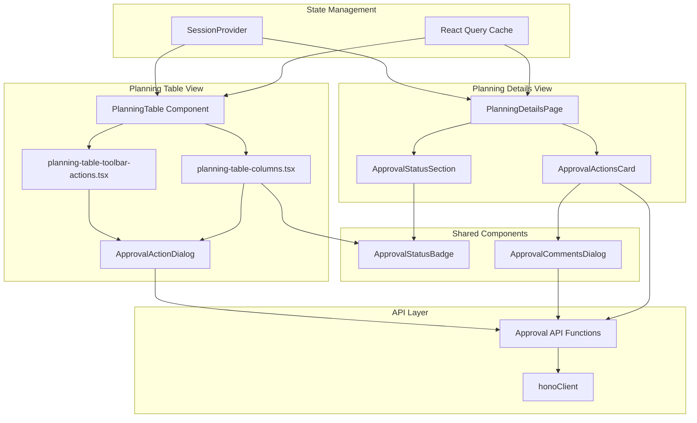

# Design Document: Planning Approval Workflow Client Integration

## Overview

This design document outlines the client-side implementation for integrating the planning approval workflow endpoints into the React-based frontend application. The implementation leverages existing patterns including the Hono client for API communication, role-based access control using the session provider, and shadcn/ui components for consistent UI/UX.

The design focuses on three primary integration points:
1. **Planning Table** - Bulk submission and quick approval actions
2. **Planning Details Page** - Detailed review with full context
3. **API Client Layer** - Type-safe endpoint integration

## Architecture

### Component Structure



## Components and Interfaces

### 1. API Client Extensions

**File: `packages/api-client/src/index.ts`**

The existing Hono client will be used to access the approval endpoints. Type inference from the server routes will provide full type safety.

```typescript
// Usage example (types are inferred from server routes)
const response = await honoClient.planning.approve.$post({
  json: {
    planningId: 123,
    action: 'APPROVE',
    comments: 'Looks good'
  }
});
```

**New Helper Functions**

```typescript
// File: packages/api-client/src/planning-approval.ts
import { honoClient, handleHonoResponse } from './index';

export async function submitForApproval(planningIds: number[]) {
  const response = await honoClient.planning['submit-for-approval'].$post({
    json: { planningIds }
  });
  return handleHonoResponse(response);
}

export async function approvePlanning(
  planningId: number,
  action: 'APPROVE' | 'REJECT',
  comments?: string
) {
  const response = await honoClient.planning.approve.$post({
    json: { planningId, action, comments }
  });
  return handleHonoResponse(response);
}

export async function reviewPlanning(
  planningId: number,
  action: 'APPROVE' | 'REJECT',
  comments?: string
) {
  const response = await honoClient.planning.review.$post({
    json: { planningId, action, comments }
  });
  return handleHonoResponse(response);
}
```

### 2. Type Definitions

**File: `apps/client/types/planning-approval.ts`**

```typescript
export type ApprovalStatus = 'DRAFT' | 'PENDING' | 'APPROVED' | 'REJECTED';

export type ApprovalAction = 'APPROVE' | 'REJECT';

export interface ApprovalStatusInfo {
  status: ApprovalStatus;
  reviewedBy: number | null;
  reviewedByName: string | null;
  reviewedAt: string | null;
  reviewComments: string | null;
}

export interface ApprovalActionRequest {
  planningId: number;
  action: ApprovalAction;
  comments?: string;
}

export interface SubmitForApprovalRequest {
  planningIds: number[];
}

export interface ApprovalActionResponse {
  success: boolean;
  message: string;
  record: {
    id: number;
    approvalStatus: ApprovalStatus;
    reviewedBy: number | null;
    reviewedByName: string | null;
    reviewedAt: string | null;
    reviewComments: string | null;
  };
}

export interface SubmitForApprovalResponse {
  success: boolean;
  message: string;
  updatedCount: number;
}
```

### 3. Shared Components

#### ApprovalStatusBadge Component

**File: `apps/client/components/planning/approval-status-badge.tsx`**

```typescript
import { Badge } from "@/components/ui/badge";
import type { ApprovalStatus } from "@/types/planning-approval";

interface ApprovalStatusBadgeProps {
  status: ApprovalStatus;
  className?: string;
}

const STATUS_CONFIG: Record<ApprovalStatus, {
  label: string;
  variant: "default" | "secondary" | "destructive" | "outline";
  className?: string;
}> = {
  DRAFT: {
    label: "Draft",
    variant: "outline",
    className: "border-gray-400 text-gray-700"
  },
  PENDING: {
    label: "Pending Review",
    variant: "secondary",
    className: "bg-yellow-100 text-yellow-800 border-yellow-300"
  },
  APPROVED: {
    label: "Approved",
    variant: "default",
    className: "bg-green-100 text-green-800 border-green-300"
  },
  REJECTED: {
    label: "Rejected",
    variant: "destructive",
    className: "bg-red-100 text-red-800 border-red-300"
  }
};

export function ApprovalStatusBadge({ status, className }: ApprovalStatusBadgeProps) {
  const config = STATUS_CONFIG[status];
  
  return (
    <Badge 
      variant={config.variant}
      className={cn(config.className, className)}
    >
      {config.label}
    </Badge>
  );
}
```

#### ApprovalCommentsDialog Component

**File: `apps/client/components/planning/approval-comments-dialog.tsx`**

```typescript
import { Dialog, DialogContent, DialogHeader, DialogTitle, DialogFooter } from "@/components/ui/dialog";
import { Button } from "@/components/ui/button";
import { Textarea } from "@/components/ui/textarea";
import { Label } from "@/components/ui/label";
import { useState } from "react";
import type { ApprovalAction } from "@/types/planning-approval";

interface ApprovalCommentsDialogProps {
  open: boolean;
  onOpenChange: (open: boolean) => void;
  action: ApprovalAction;
  planningId: number;
  onConfirm: (comments?: string) => Promise<void>;
  isLoading?: boolean;
}

export function ApprovalCommentsDialog({
  open,
  onOpenChange,
  action,
  planningId,
  onConfirm,
  isLoading = false
}: ApprovalCommentsDialogProps) {
  const [comments, setComments] = useState("");
  const isReject = action === 'REJECT';
  
  const handleConfirm = async () => {
    await onConfirm(comments || undefined);
    setComments("");
  };
  
  return (
    <Dialog open={open} onOpenChange={onOpenChange}>
      <DialogContent>
        <DialogHeader>
          <DialogTitle>
            {isReject ? 'Reject Plan' : 'Approve Plan'}
          </DialogTitle>
        </DialogHeader>
        
        <div className="space-y-4 py-4">
          <div className="space-y-2">
            <Label htmlFor="comments">
              Comments {isReject && <span className="text-destructive">*</span>}
            </Label>
            <Textarea
              id="comments"
              placeholder={isReject 
                ? "Please provide a reason for rejection..." 
                : "Optional comments..."}
              value={comments}
              onChange={(e) => setComments(e.target.value)}
              rows={4}
              required={isReject}
            />
          </div>
        </div>
        
        <DialogFooter>
          <Button
            variant="outline"
            onClick={() => onOpenChange(false)}
            disabled={isLoading}
          >
            Cancel
          </Button>
          <Button
            variant={isReject ? "destructive" : "default"}
            onClick={handleConfirm}
            disabled={isLoading || (isReject && !comments.trim())}
          >
            {isLoading ? "Processing..." : (isReject ? "Reject" : "Approve")}
          </Button>
        </DialogFooter>
      </DialogContent>
    </Dialog>
  );
}
```

### 4. Planning Table Integration

#### Update PlanningActivity Interface

**File: `apps/client/app/dashboard/planning/_components/planning-table-columns.tsx`**

Add approval fields to the existing interface:

```typescript
export interface PlanningActivity {
  // ... existing fields
  approvalStatus: ApprovalStatus;
  reviewedBy: number | null;
  reviewedAt: string | null;
  reviewComments: string | null;
  reviewer?: {
    id: number;
    name: string;
    email: string;
  } | null;
}
```

#### Add Approval Status Column

```typescript
{
  id: "approvalStatus",
  accessorKey: "approvalStatus",
  header: "Status",
  cell: ({ row }) => {
    const status = row.original.approvalStatus;
    return <ApprovalStatusBadge status={status} />;
  },
  enableSorting: true,
  enableColumnFilter: true,
  meta: {
    label: "Approval Status",
    variant: "select",
    options: [
      { label: "Draft", value: "DRAFT" },
      { label: "Pending", value: "PENDING" },
      { label: "Approved", value: "APPROVED" },
      { label: "Rejected", value: "REJECTED" },
    ],
  },
}
```

#### Enhance Actions Column

```typescript
{
  id: "actions",
  header: "Actions",
  cell: ({ row }) => {
    const planning = row.original;
    const user = useUser();
    const isAdmin = user?.role === 'admin' || user?.role === 'superadmin';
    const isPending = planning.approvalStatus === 'PENDING';
    
    return (
      <DropdownMenu>
        <DropdownMenuTrigger asChild>
          <Button variant="ghost" className="h-8 w-8 p-0">
            <MoreHorizontal className="h-4 w-4" />
          </Button>
        </DropdownMenuTrigger>
        <DropdownMenuContent align="end" className="w-40">
          <DropdownMenuItem
            onClick={() => router.push(`/dashboard/planning/details/${planning.id}`)}
          >
            <Eye className="mr-2 h-4 w-4" />
            View Details
          </DropdownMenuItem>
          
          {planning.approvalStatus === 'DRAFT' && (
            <DropdownMenuItem
              onClick={() => router.push(`/dashboard/planning/edit/${planning.id}`)}
            >
              <Edit className="mr-2 h-4 w-4" />
              Edit
            </DropdownMenuItem>
          )}
          
          {isAdmin && isPending && (
            <>
              <DropdownMenuSeparator />
              <DropdownMenuItem
                onClick={() => setRowAction({ 
                  variant: "approve", 
                  row,
                  action: 'APPROVE'
                })}
                className="text-green-600"
              >
                <CheckCircle className="mr-2 h-4 w-4" />
                Approve
              </DropdownMenuItem>
              <DropdownMenuItem
                onClick={() => setRowAction({ 
                  variant: "approve", 
                  row,
                  action: 'REJECT'
                })}
                className="text-destructive"
              >
                <XCircle className="mr-2 h-4 w-4" />
                Reject
              </DropdownMenuItem>
            </>
          )}
          
          <DropdownMenuSeparator />
          <DropdownMenuItem
            onClick={() => setRowAction({ variant: "delete", row })}
            className="text-destructive"
          >
            <Trash2 className="mr-2 h-4 w-4" />
            Delete
          </DropdownMenuItem>
        </DropdownMenuContent>
      </DropdownMenu>
    );
  },
}
```

#### Add Toolbar Actions for Bulk Submit

**File: `apps/client/app/dashboard/planning/_components/planning-table-toolbar-actions.tsx`**

```typescript
import { Button } from "@/components/ui/button";
import { Send } from "lucide-react";
import { useUser } from "@/components/providers/session-provider";
import { submitForApproval } from "@rina/api-client/planning-approval";
import { useToast } from "@/hooks/use-toast";
import { useState } from "react";

interface PlanningTableToolbarActionsProps {
  table: any; // TanStack Table instance
  onRefresh: () => void;
}

export function PlanningTableToolbarActions({ 
  table, 
  onRefresh 
}: PlanningTableToolbarActionsProps) {
  const user = useUser();
  const { toast } = useToast();
  const [isSubmitting, setIsSubmitting] = useState(false);
  
  const selectedRows = table.getFilteredSelectedRowModel().rows;
  const selectedDraftPlans = selectedRows.filter(
    (row: any) => row.original.approvalStatus === 'DRAFT'
  );
  
  const canSubmit = user?.role === 'accountant' && selectedDraftPlans.length > 0;
  
  const handleSubmitForApproval = async () => {
    try {
      setIsSubmitting(true);
      const planningIds = selectedDraftPlans.map((row: any) => row.original.id);
      
      const result = await submitForApproval(planningIds);
      
      toast({
        title: "Success",
        description: `${result.updatedCount} plan(s) submitted for approval`,
      });
      
      table.resetRowSelection();
      onRefresh();
    } catch (error) {
      toast({
        title: "Error",
        description: error instanceof Error ? error.message : "Failed to submit plans",
        variant: "destructive",
      });
    } finally {
      setIsSubmitting(false);
    }
  };
  
  return (
    <div className="flex items-center gap-2">
      {canSubmit && (
        <Button
          variant="default"
          size="sm"
          onClick={handleSubmitForApproval}
          disabled={isSubmitting}
        >
          <Send className="mr-2 h-4 w-4" />
          Submit for Approval ({selectedDraftPlans.length})
        </Button>
      )}
      
      {/* Other existing toolbar actions */}
    </div>
  );
}
```

### 5. Planning Details Page Integration

**File: `apps/client/app/dashboard/planning/details/[id]/page.tsx`**

#### Approval Status Section

```typescript
function ApprovalStatusSection({ planning }: { planning: PlanningActivity }) {
  return (
    <Card>
      <CardHeader>
        <CardTitle>Approval Status</CardTitle>
      </CardHeader>
      <CardContent className="space-y-4">
        <div className="flex items-center justify-between">
          <span className="text-sm font-medium">Current Status:</span>
          <ApprovalStatusBadge status={planning.approvalStatus} />
        </div>
        
        {planning.reviewedBy && (
          <>
            <Separator />
            <div className="space-y-2">
              <div className="flex items-center justify-between">
                <span className="text-sm text-muted-foreground">Reviewed By:</span>
                <span className="text-sm font-medium">
                  {planning.reviewer?.name || 'Unknown'}
                </span>
              </div>
              
              {planning.reviewedAt && (
                <div className="flex items-center justify-between">
                  <span className="text-sm text-muted-foreground">Reviewed At:</span>
                  <span className="text-sm">
                    {new Date(planning.reviewedAt).toLocaleString()}
                  </span>
                </div>
              )}
              
              {planning.reviewComments && (
                <div className="space-y-1">
                  <span className="text-sm text-muted-foreground">Comments:</span>
                  <p className="text-sm bg-muted p-3 rounded-md">
                    {planning.reviewComments}
                  </p>
                </div>
              )}
            </div>
          </>
        )}
      </CardContent>
    </Card>
  );
}
```

#### Approval Actions Card

```typescript
function ApprovalActionsCard({ 
  planning, 
  onRefresh 
}: { 
  planning: PlanningActivity;
  onRefresh: () => void;
}) {
  const user = useUser();
  const { toast } = useToast();
  const [dialogOpen, setDialogOpen] = useState(false);
  const [currentAction, setCurrentAction] = useState<ApprovalAction>('APPROVE');
  const [isLoading, setIsLoading] = useState(false);
  
  const isAdmin = user?.role === 'admin' || user?.role === 'superadmin';
  const isPending = planning.approvalStatus === 'PENDING';
  const canApprove = isAdmin && isPending;
  
  if (!canApprove) return null;
  
  const handleApprovalAction = async (comments?: string) => {
    try {
      setIsLoading(true);
      
      const result = await approvePlanning(
        planning.id,
        currentAction,
        comments
      );
      
      toast({
        title: "Success",
        description: result.message,
      });
      
      setDialogOpen(false);
      onRefresh();
    } catch (error) {
      toast({
        title: "Error",
        description: error instanceof Error ? error.message : "Action failed",
        variant: "destructive",
      });
    } finally {
      setIsLoading(false);
    }
  };
  
  return (
    <>
      <Card>
        <CardHeader>
          <CardTitle>Review Actions</CardTitle>
          <CardDescription>
            Approve or reject this planning submission
          </CardDescription>
        </CardHeader>
        <CardContent className="flex gap-3">
          <Button
            variant="default"
            className="flex-1"
            onClick={() => {
              setCurrentAction('APPROVE');
              setDialogOpen(true);
            }}
          >
            <CheckCircle className="mr-2 h-4 w-4" />
            Approve Plan
          </Button>
          
          <Button
            variant="destructive"
            className="flex-1"
            onClick={() => {
              setCurrentAction('REJECT');
              setDialogOpen(true);
            }}
          >
            <XCircle className="mr-2 h-4 w-4" />
            Reject Plan
          </Button>
        </CardContent>
      </Card>
      
      <ApprovalCommentsDialog
        open={dialogOpen}
        onOpenChange={setDialogOpen}
        action={currentAction}
        planningId={planning.id}
        onConfirm={handleApprovalAction}
        isLoading={isLoading}
      />
    </>
  );
}
```

## Data Models

### Enhanced Planning Data Model

```typescript
// Extended from existing PlanningActivity interface
interface PlanningActivityWithApproval extends PlanningActivity {
  approvalStatus: ApprovalStatus;
  reviewedBy: number | null;
  reviewedAt: string | null;
  reviewComments: string | null;
  reviewer?: {
    id: number;
    name: string;
    email: string;
  } | null;
}
```

## Error Handling

### API Error Handling Pattern

```typescript
try {
  const result = await approvePlanning(planningId, action, comments);
  // Success handling
} catch (error) {
  if (error instanceof ApiError) {
    // Handle specific API errors
    switch (error.status) {
      case 403:
        toast({
          title: "Permission Denied",
          description: "You don't have permission to perform this action",
          variant: "destructive",
        });
        break;
      case 404:
        toast({
          title: "Not Found",
          description: "Planning record not found",
          variant: "destructive",
        });
        break;
      case 400:
        toast({
          title: "Invalid Request",
          description: error.response?.message || "Please check your input",
          variant: "destructive",
        });
        break;
      default:
        toast({
          title: "Error",
          description: error.message,
          variant: "destructive",
        });
    }
  } else {
    // Handle network or unexpected errors
    toast({
      title: "Error",
      description: "An unexpected error occurred",
      variant: "destructive",
    });
  }
}
```

### Validation Rules

1. **Bulk Submit**: Only DRAFT plans can be submitted
2. **Approval Actions**: Only PENDING plans can be approved/rejected
3. **Role Checks**: Validate user role before showing actions
4. **Comments**: Require comments for rejection, optional for approval
5. **Loading States**: Disable buttons during API calls

## Testing Strategy

### Component Testing

1. **ApprovalStatusBadge**
   - Test correct variant and label for each status
   - Test custom className application

2. **ApprovalCommentsDialog**
   - Test required comments for rejection
   - Test optional comments for approval
   - Test loading state behavior
   - Test dialog open/close

3. **Planning Table Integration**
   - Test approval status column rendering
   - Test role-based action visibility
   - Test bulk submit functionality
   - Test quick approve/reject from dropdown

4. **Planning Details Page**
   - Test approval status section display
   - Test approval actions card visibility
   - Test approval action execution
   - Test error handling

### Integration Testing

1. **End-to-End Approval Flow**
   - Create plan → Submit for approval → Admin review → Status update
   - Test notification and UI refresh

2. **Role-Based Access**
   - Test accountant can submit but not approve
   - Test admin can approve but not submit
   - Test superadmin has all permissions

3. **Error Scenarios**
   - Test network errors
   - Test permission errors
   - Test validation errors
   - Test concurrent updates

## Security Considerations

1. **Client-Side Role Checks**: UI-level only, server enforces permissions
2. **Token Management**: Credentials included in all requests via Hono client
3. **Input Sanitization**: Comments sanitized before display
4. **CSRF Protection**: Handled by cookie-based authentication
5. **XSS Prevention**: React's built-in escaping for user content

## Performance Considerations

1. **Optimistic Updates**: Update UI immediately, rollback on error
2. **Query Invalidation**: Use React Query to invalidate and refetch after mutations
3. **Debouncing**: Prevent duplicate submissions with loading states
4. **Lazy Loading**: Load approval history only when needed
5. **Memoization**: Memoize role checks and permission calculations

## Accessibility

1. **Keyboard Navigation**: All actions accessible via keyboard
2. **Screen Readers**: Proper ARIA labels on buttons and dialogs
3. **Focus Management**: Focus trap in dialogs, return focus on close
4. **Color Contrast**: Status badges meet WCAG AA standards
5. **Error Announcements**: Toast notifications announced to screen readers

## Migration Strategy

1. **Backward Compatibility**: Existing planning pages continue to work
2. **Feature Flag**: Optional feature flag for gradual rollout
3. **Data Migration**: Backend handles approval status defaults
4. **User Training**: Documentation for new approval workflow
5. **Rollback Plan**: Can disable approval UI without breaking existing functionality
