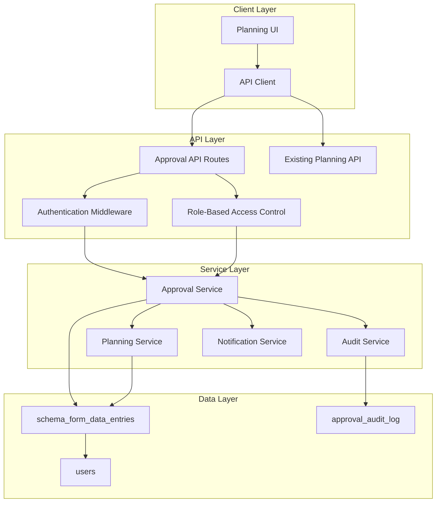

# Design Document: Planning Approval Workflow

## Overview

The Planning Approval Workflow extends the existing planning system to implement a structured approval process for plans created by planners/accountants. The system leverages the existing database schema and API patterns while adding new endpoints and business logic to enforce approval workflows and execution restrictions.

The design builds upon the current `schema_form_data_entries` table which already contains approval-related fields (`approvalStatus`, `reviewedBy`, `reviewedAt`, `reviewComments`) and integrates with the existing planning API structure.

## Architecture

### System Components



### Data Flow

1. **Plan Creation**: Planner creates/uploads plan → Status set to PENDING
2. **Notification**: System notifies designated Admins of pending review
3. **Review Process**: Admin reviews plan details and makes approval decision
4. **Status Update**: System updates approval status and records audit trail
5. **Execution Enforcement**: System validates approval status before allowing execution

## Components and Interfaces

### 1. Database Schema Extensions

The existing `schema_form_data_entries` table already contains the necessary approval fields:

```sql
-- Existing approval fields in schema_form_data_entries
approvalStatus: approvalStatus("approval_status").default('PENDING')
reviewedBy: integer("reviewed_by") -- Foreign key to users.id
reviewedAt: timestamp("reviewed_at", { mode: 'date' })
reviewComments: text("review_comments")
```

**New Table: Approval Audit Log**

```sql
CREATE TABLE approval_audit_log (
  id SERIAL PRIMARY KEY,
  planning_id INTEGER NOT NULL REFERENCES schema_form_data_entries(id),
  previous_status approval_status,
  new_status approval_status NOT NULL,
  action_by INTEGER NOT NULL REFERENCES users(id),
  action_at TIMESTAMP DEFAULT CURRENT_TIMESTAMP,
  comments TEXT,
  metadata JSONB -- Additional context like IP, user agent, etc.
);
```

### 2. API Endpoints

**New Approval Endpoint**
```typescript
POST /api/planning/approve
{
  "planningId": number,
  "action": "APPROVE" | "REJECT",
  "comments": string?
}
```

**Enhanced Existing Endpoints**
- `GET /api/planning` - Add `approvalStatus` filter
- `GET /api/planning/{id}/approval-history` - Already exists
- `POST /api/planning/bulk-review` - Already exists

### 3. Service Layer Components

**ApprovalService**
```typescript
interface ApprovalService {
  approvePlan(planningId: number, adminId: number, comments?: string): Promise<ApprovalResult>
  rejectPlan(planningId: number, adminId: number, comments: string): Promise<ApprovalResult>
  validateExecutionPermission(planningId: number): Promise<boolean>
  getApprovalHistory(planningId: number): Promise<ApprovalHistory[]>
  bulkReview(planningIds: number[], action: ApprovalAction, adminId: number, comments?: string): Promise<BulkReviewResult>
}
```

**AuditService**
```typescript
interface AuditService {
  logApprovalAction(planningId: number, previousStatus: ApprovalStatus, newStatus: ApprovalStatus, actionBy: number, comments?: string): Promise<void>
  getAuditTrail(planningId: number): Promise<AuditEntry[]>
}
```

**NotificationService**
```typescript
interface NotificationService {
  notifyPendingReview(planningId: number, adminIds: number[]): Promise<void>
  notifyApprovalDecision(planningId: number, plannerId: number, status: ApprovalStatus): Promise<void>
}
```

### 4. Role-Based Access Control

**Permission Matrix**
| Role | Create Plan | Review Plan | Approve/Reject | Execute Plan | View Audit |
|------|-------------|-------------|----------------|--------------|------------|
| accountant | ✓ | ✗ | ✗ | ✓ (approved only) | ✗ |
| admin | ✗ | ✓ | ✓ | ✓ (approved only) | ✓ |
| superadmin | ✓ | ✓ | ✓ | ✓ | ✓ |
| program_manager | ✗ | ✓ | ✗ | ✓ (approved only) | ✓ |

## Data Models

### Core Types

```typescript
enum ApprovalStatus {
  DRAFT = 'DRAFT',
  PENDING = 'PENDING', 
  APPROVED = 'APPROVED',
  REJECTED = 'REJECTED'
}

enum ApprovalAction {
  APPROVE = 'APPROVE',
  REJECT = 'REJECT'
}

interface ApprovalRequest {
  planningId: number
  action: ApprovalAction
  comments?: string
}

interface ApprovalResult {
  success: boolean
  message: string
  record: {
    id: number
    approvalStatus: ApprovalStatus
    approvedBy: number | null
    approvedAt: string | null
    reviewComments: string | null
  }
}

interface AuditEntry {
  id: number
  planningId: number
  previousStatus: ApprovalStatus | null
  newStatus: ApprovalStatus
  actionBy: number
  actionAt: string
  comments: string | null
  metadata: Record<string, any>
}
```

### Enhanced Planning Data Model

```typescript
interface PlanningDataWithApproval extends SelectPlanningData {
  approvalStatus: ApprovalStatus
  reviewedBy: number | null
  reviewedAt: string | null
  reviewComments: string | null
  reviewer?: {
    id: number
    name: string
    email: string
  }
}
```

## Error Handling

### Validation Rules

1. **Plan Existence**: Verify planning ID exists before approval actions
2. **Status Transitions**: Enforce valid status transitions (PENDING → APPROVED/REJECTED)
3. **Permission Checks**: Validate user has approval permissions
4. **Comment Requirements**: Require comments for rejection actions
5. **Execution Validation**: Block execution for non-approved plans

### Error Response Format

```typescript
interface ApprovalError {
  code: string
  message: string
  details?: Record<string, any>
}

// Error Codes
const APPROVAL_ERRORS = {
  PLAN_NOT_FOUND: 'PLAN_NOT_FOUND',
  INVALID_STATUS_TRANSITION: 'INVALID_STATUS_TRANSITION', 
  INSUFFICIENT_PERMISSIONS: 'INSUFFICIENT_PERMISSIONS',
  COMMENTS_REQUIRED: 'COMMENTS_REQUIRED',
  EXECUTION_BLOCKED: 'EXECUTION_BLOCKED'
} as const
```

### Execution Enforcement

```typescript
// Middleware for execution endpoints
async function validateApprovalStatus(planningId: number): Promise<void> {
  const plan = await db.query.schemaFormDataEntries.findFirst({
    where: eq(schemaFormDataEntries.id, planningId)
  })
  
  if (!plan) {
    throw new Error('Plan not found')
  }
  
  if (plan.approvalStatus !== 'APPROVED') {
    throw new ApprovalError({
      code: 'EXECUTION_BLOCKED',
      message: 'This plan has not been approved for execution',
      details: { 
        planningId, 
        currentStatus: plan.approvalStatus 
      }
    })
  }
}
```

## Testing Strategy

### Unit Tests

1. **ApprovalService Tests**
   - Test approval/rejection logic
   - Validate status transitions
   - Test permission enforcement
   - Test audit logging

2. **API Endpoint Tests**
   - Test approval endpoint with valid/invalid requests
   - Test role-based access control
   - Test error handling scenarios

3. **Validation Tests**
   - Test execution blocking for unapproved plans
   - Test comment requirements
   - Test status transition rules

### Integration Tests

1. **End-to-End Approval Workflow**
   - Create plan → Submit for approval → Admin review → Execution
   - Test notification flow
   - Test audit trail generation

2. **Role-Based Access Tests**
   - Test different user roles and permissions
   - Test cross-role interactions

3. **Database Integration Tests**
   - Test audit log creation
   - Test referential integrity
   - Test concurrent approval scenarios

### API Testing

```typescript
// Example test cases
describe('Planning Approval API', () => {
  test('should approve plan with valid admin user', async () => {
    const response = await request(app)
      .post('/api/planning/approve')
      .set('Authorization', `Bearer ${adminToken}`)
      .send({
        planningId: 123,
        action: 'APPROVE',
        comments: 'All values verified'
      })
    
    expect(response.status).toBe(200)
    expect(response.body.record.approvalStatus).toBe('APPROVED')
  })
  
  test('should reject plan approval for non-admin user', async () => {
    const response = await request(app)
      .post('/api/planning/approve')
      .set('Authorization', `Bearer ${plannerToken}`)
      .send({
        planningId: 123,
        action: 'APPROVE'
      })
    
    expect(response.status).toBe(403)
  })
  
  test('should block execution of unapproved plan', async () => {
    const response = await request(app)
      .post('/api/execution/create')
      .set('Authorization', `Bearer ${userToken}`)
      .send({
        planningId: 456, // Plan with PENDING status
        executionData: {}
      })
    
    expect(response.status).toBe(400)
    expect(response.body.code).toBe('EXECUTION_BLOCKED')
  })
})
```

## Security Considerations

1. **Authentication**: All approval endpoints require valid JWT tokens
2. **Authorization**: Role-based permissions enforced at API and service levels
3. **Audit Trail**: Immutable logging of all approval actions
4. **Input Validation**: Strict validation of approval requests
5. **Rate Limiting**: Prevent abuse of approval endpoints
6. **Data Integrity**: Atomic transactions for status updates and audit logging

## Performance Considerations

1. **Database Indexing**: Add indexes on `approvalStatus` and `reviewedBy` fields
2. **Caching**: Cache user permissions and role mappings
3. **Batch Operations**: Support bulk approval operations for efficiency
4. **Pagination**: Implement pagination for approval history and audit logs
5. **Query Optimization**: Optimize queries for approval status filtering

## Migration Strategy

1. **Database Migration**: The approval fields already exist in the schema
2. **API Versioning**: New endpoints follow existing API patterns
3. **Backward Compatibility**: Existing planning endpoints remain unchanged
4. **Feature Flags**: Use feature flags to gradually roll out approval workflow
5. **Data Migration**: Set existing plans to appropriate approval status based on business rules