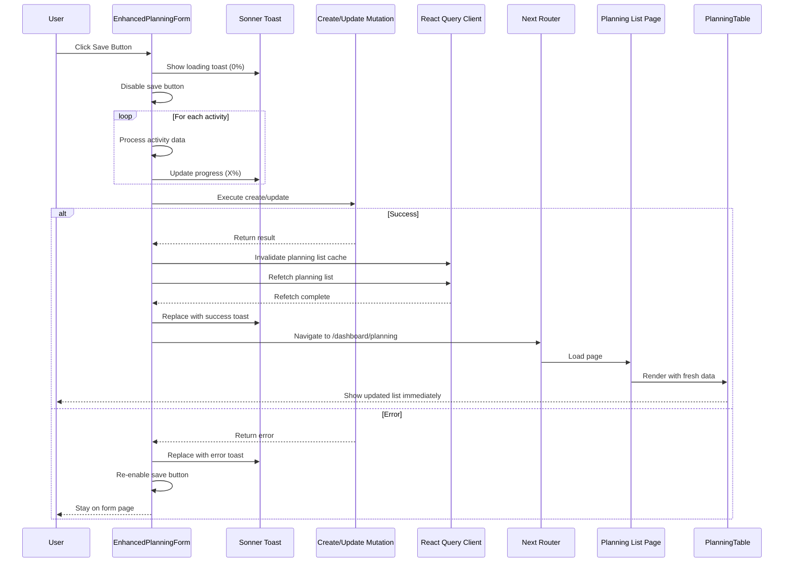

# Design Document

## Overview

This design implements comprehensive loading states for the planning module to improve user experience during data operations. The solution addresses three key areas:

1. **Save Operation Feedback**: Progressive loading indicators during create/update operations with percentage-based progress tracking
2. **Data Synchronization**: Ensuring newly created/updated data appears immediately in the listing page without manual refresh
3. **Skeleton Loading**: Implementing skeleton screens in the planning listing page during initial data fetch

The design leverages existing infrastructure (React Query, Sonner toast library, DataTableSkeleton component) and follows established patterns in the codebase.

## Architecture

### Component Structure

```
apps/client/
├── features/planning/v3/
│   └── enhanced-planning-form.tsx (Modified)
├── app/dashboard/planning/
│   ├── page.tsx (Modified)
│   └── _components/
│       └── planning-table.tsx (Modified)
└── components/data-table/
    └── data-table-skeleton.tsx (Existing)
```

### Data Flow



## Components and Interfaces

### 1. Enhanced Planning Form (Modified)

**File**: `apps/client/features/planning/v3/enhanced-planning-form.tsx`

**Changes**:

#### A. Save Operation State Management

```typescript
interface SaveOperationState {
  isSubmitting: boolean;
  progress: number;
  currentStep: string;
}
```

Add state to track save operation progress:
- `isSubmitting`: Boolean to disable form during save
- `progress`: Number (0-100) for progress tracking
- `currentStep`: String describing current operation

#### B. Enhanced handleSubmit Function

Current implementation (lines 390-450):
- Shows loading toast with progress
- Processes activities sequentially
- Updates toast with percentage
- Calls mutation
- Invalidates and refetches queries
- Shows success toast
- Redirects to listing page

**Design Changes**:

1. **Proper Toast Sequencing**: Ensure loading toast completes before success toast
2. **Wait for Refetch**: Use `await` on refetch to ensure data is synchronized
3. **Error Handling**: Keep user on form page on error
4. **Button State**: Disable save button during operation

```typescript
const handleSubmit = useCallback(async () => {
  try {
    // Validation
    const validation = await validateForm();
    if (!validation.isValid) {
      toast.error('Please fix validation errors before submitting');
      return;
    }

    // Schema and data checks
    if (!formSchema?.id) {
      toast.error('Form schema not loaded. Please refresh the page.');
      return;
    }

    if (!formData || Object.keys(formData).length === 0) {
      toast.error('No data to submit. Please fill in some activities.');
      return;
    }

    // Start loading toast
    const operationType = mode === 'create' ? 'Creating' : 'Updating';
    const toastId = toast.loading(`${operationType} planning data... 0%`);
    
    // Prepare data with progress tracking
    const activityIds = Object.keys(formData || {});
    const totalRows = activityIds.length || 1;
    const normalizedActivities: Record<string, any> = {};

    // Process activities with progress updates
    activityIds.forEach((id, i) => {
      const a: any = (formData as any)[id] || {};
      const toNum = (v: any, d = 0) => {
        const n = typeof v === 'string' ? parseFloat(v.replace(/[,$\s]/g, '')) : v;
        return Number.isFinite(n) ? Number(n) : d;
      };
      
      normalizedActivities[id] = {
        frequency: toNum(a.frequency, 1),
        unit_cost: toNum(a.unit_cost ?? a.unitCost, 0),
        q1_count: toNum(a.q1_count ?? a.q1Count, 0),
        q2_count: toNum(a.q2_count ?? a.q2Count, 0),
        q3_count: toNum(a.q3_count ?? a.q3Count, 0),
        q4_count: toNum(a.q4_count ?? a.q4Count, 0),
        comments: (a.comments ?? '').toString().trim(),
      };

      // Update progress
      const percent = Math.round(((i + 1) / totalRows) * 100);
      toast.loading(`${operationType} planning data... ${percent}%`, {
        id: toastId,
        description: `Processing activity ${i + 1} of ${totalRows}`
      });
    });

    const submissionData = { activities: normalizedActivities };

    // Execute mutation
    if (mode === 'create') {
      const result = await createMutation.mutateAsync({
        schemaId: formSchema.id,
        projectId,
        facilityId,
        reportingPeriodId,
        formData: submissionData,
        metadata: {
          projectType,
          facilityType,
          submittedAt: new Date().toISOString()
        }
      });
      
      // Synchronize data before redirect
      await queryClient.invalidateQueries({ queryKey: ['planning', 'list'] });
      await queryClient.invalidateQueries({ queryKey: ['planning-activities'] });
      
      // Wait for refetch to complete
      await queryClient.refetchQueries({ 
        queryKey: ['planning-activities'],
        type: 'active'
      });
      
      // Show success toast AFTER loading completes
      toast.success('Planning data created successfully!', { id: toastId });
      
      // Call success callback
      onSuccess?.(result);
      
      // Redirect after a brief delay to ensure toast is visible
      setTimeout(() => {
        router.push('/dashboard/planning');
      }, 500);
      
    } else {
      // Similar logic for update
      const result = await updateMutation.mutateAsync({
        id: planningId!,
        data: {
          formData: submissionData,
          reportingPeriodId,
          metadata: {
            projectType,
            facilityType,
            updatedAt: new Date().toISOString()
          }
        }
      });
      
      await queryClient.invalidateQueries({ queryKey: ['planning', 'list'] });
      await queryClient.invalidateQueries({ queryKey: ['planning-activities'] });
      await queryClient.refetchQueries({ 
        queryKey: ['planning-activities'],
        type: 'active'
      });
      
      toast.success('Planning data updated successfully!', { id: toastId });
      onSuccess?.(result);
      
      setTimeout(() => {
        router.push('/dashboard/planning');
      }, 500);
    }
    
  } catch (error) {
    console.error('Submit error:', error);
    const planningError = handleApiError(error);
    toast.error(planningError.message);
    // User stays on form page to retry
  }
}, [/* dependencies */]);
```

#### C. Button State Management

Update the save button to be disabled during submission:

```typescript
<Button
  onClick={handleSubmit}
  disabled={createMutation.isPending || updateMutation.isPending}
>
  {(createMutation.isPending || updateMutation.isPending) && (
    <Loader2 className="h-4 w-4 mr-2 animate-spin" />
  )}
  {mode === 'create' ? 'Create Planning' : 'Update Planning'}
</Button>
```

### 2. Planning Table Component (Modified)

**File**: `apps/client/app/dashboard/planning/_components/planning-table.tsx`

**Changes**:

Replace the simple loading text with the DataTableSkeleton component:

```typescript
if (isLoading) {
  return (
    <DataTableSkeleton
      columnCount={8}
      rowCount={10}
      filterCount={3}
      cellWidths={["200px", "150px", "150px", "150px", "120px", "120px", "150px", "100px"]}
      withViewOptions={false}
      withPagination={true}
      shrinkZero={false}
    />
  );
}
```

**Column Count Calculation**:
Based on the planning table columns (from getPlanningTableColumns):
1. Facility Name
2. Facility Type
3. Project Type
4. Reporting Period
5. Status
6. Created At
7. Updated At
8. Actions

Total: 8 columns

### 3. Planning Page (Modified)

**File**: `apps/client/app/dashboard/planning/page.tsx`

**Changes**:

Update the loading state to use a more sophisticated skeleton:

```typescript
if (isLoadingProjects) {
  return (
    <div className="container mx-auto p-4 md:p-8 h-full">
      <div className="space-y-6">
        <div className="flex items-center justify-between">
          <div className="space-y-2">
            <Skeleton className="h-8 w-64" />
            <Skeleton className="h-4 w-96" />
          </div>
        </div>
        <DataTableSkeleton
          columnCount={8}
          rowCount={10}
          filterCount={3}
          withPagination={true}
        />
      </div>
    </div>
  );
}
```

## Data Models

### Toast State

The Sonner library manages toast state internally. We use the following toast methods:

```typescript
// Loading toast with ID for updates
const toastId = toast.loading(message, options);

// Update existing toast
toast.loading(message, { id: toastId, description });

// Replace loading toast with success
toast.success(message, { id: toastId });

// Replace loading toast with error
toast.error(message, { id: toastId });
```

### Query Keys

Update query invalidation to include both keys:

```typescript
// Invalidate both query keys
await queryClient.invalidateQueries({ queryKey: ['planning', 'list'] });
await queryClient.invalidateQueries({ queryKey: ['planning-activities'] });

// Refetch with specific options
await queryClient.refetchQueries({ 
  queryKey: ['planning-activities'],
  type: 'active'  // Only refetch active queries
});
```

## Error Handling

### Save Operation Errors

1. **Validation Errors**: Show error toast, keep user on form
2. **Network Errors**: Show error toast with retry option, keep user on form
3. **Server Errors**: Show error toast with error message, keep user on form
4. **Refetch Errors**: Log warning but still redirect (data will load on page)

```typescript
try {
  // ... save operation
} catch (error) {
  console.error('Submit error:', error);
  const planningError = handleApiError(error);
  toast.error(planningError.message);
  // User stays on form - button is re-enabled automatically
}
```

### Loading State Errors

If data fetch fails in the listing page, show error message instead of skeleton:

```typescript
if (error) {
  return (
    <div className="container mx-auto p-4 md:p-8 h-full">
      <Alert variant="destructive">
        <AlertCircle className="h-4 w-4" />
        <AlertTitle>Error</AlertTitle>
        <AlertDescription>
          Failed to load planning activities: {error.message}
        </AlertDescription>
      </Alert>
    </div>
  );
}
```

## Testing Strategy

### Unit Tests

1. **Toast Sequencing**: Verify loading toast appears before success toast
2. **Progress Updates**: Verify progress percentage updates correctly
3. **Button State**: Verify button is disabled during submission
4. **Error Handling**: Verify user stays on form on error

### Integration Tests

1. **Create Flow**: 
   - Create planning data
   - Verify loading toast with progress
   - Verify success toast
   - Verify redirect to listing page
   - Verify new data appears in list

2. **Update Flow**:
   - Update existing planning data
   - Verify loading toast with progress
   - Verify success toast
   - Verify redirect to listing page
   - Verify updated data appears in list

3. **Error Flow**:
   - Trigger save error
   - Verify error toast
   - Verify user stays on form
   - Verify button is re-enabled

4. **Skeleton Loading**:
   - Navigate to planning list
   - Verify skeleton appears during load
   - Verify skeleton is replaced with data

### Manual Testing Checklist

- [ ] Create planning data and observe loading toast with progress
- [ ] Verify success toast appears after loading completes
- [ ] Verify redirect happens after success toast
- [ ] Verify new data appears immediately in listing (no refresh needed)
- [ ] Update planning data and observe same flow
- [ ] Trigger error and verify user stays on form
- [ ] Navigate to planning list and observe skeleton loading
- [ ] Verify skeleton matches table structure
- [ ] Test with slow network to observe loading states
- [ ] Test with fast network to ensure no flashing

## Performance Considerations

### 1. Toast Updates

Updating toast progress for each activity is efficient as it only updates the DOM element, not re-rendering the entire component.

### 2. Query Refetch

Using `await` on refetch ensures data is synchronized but adds latency. This is acceptable as:
- User sees progress feedback via toast
- Ensures data consistency
- Prevents the "data not showing" bug

### 3. Skeleton Loading

The DataTableSkeleton component is lightweight and renders quickly:
- Uses CSS for animations
- Minimal DOM elements
- No data fetching

### 4. Redirect Delay

The 500ms delay before redirect ensures:
- Success toast is visible to user
- Smooth transition
- No jarring UI changes

## Migration Notes

### Breaking Changes

None. All changes are additive or internal improvements.

### Backward Compatibility

- Existing planning data is not affected
- API contracts remain unchanged
- Component props remain unchanged

### Deployment

1. Deploy changes to staging
2. Test all flows (create, update, list)
3. Verify loading states work correctly
4. Deploy to production
5. Monitor for any issues

## Future Enhancements

1. **Optimistic Updates**: Update UI immediately before server response
2. **Offline Support**: Queue operations when offline
3. **Batch Operations**: Support bulk create/update with progress
4. **Advanced Progress**: Show which specific activity is being processed
5. **Retry Logic**: Automatic retry on transient failures
