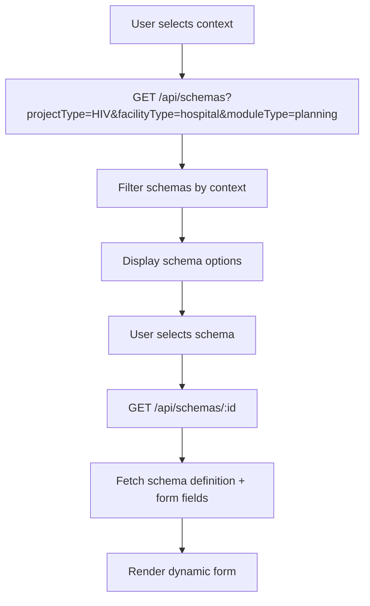
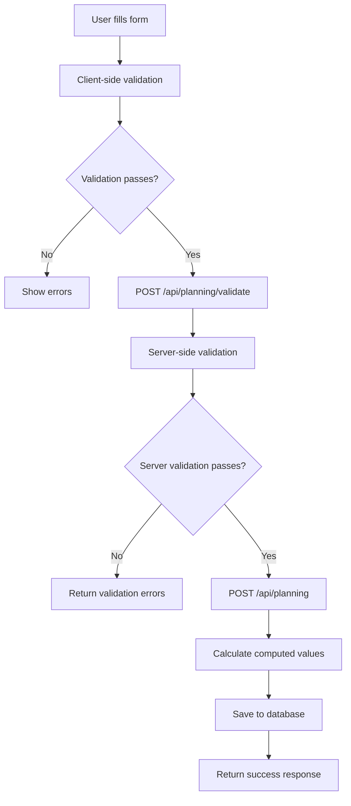

# Planning Module UI/UX Specification

## 1. Introduction & Objective

### Purpose
The Planning module is a schema-driven system that enables accountants to create, edit, and manage annual financial plans dynamically based on project type, facility type, and reporting period context. The module adapts its form structure and validation rules automatically based on predefined schemas, ensuring consistency and compliance across different organizational contexts.

### Key Objectives
- **Dynamic Adaptation**: Forms automatically adjust based on project type (HIV, Malaria, TB), facility type (hospital, health_center), and reporting period
- **Schema-Driven Validation**: Real-time validation using server-side schema definitions with client-side preview
- **Computed Values**: Automatic calculation of totals, subtotals, and derived values based on form data
- **Audit Trail**: Complete versioning and history tracking for all planning data
- **Role-Based Access**: Accountant-focused interface with appropriate permissions and workflows

### Accountant Role
Accountants are the primary users responsible for:
- Creating annual financial plans for specific projects and facilities
- Inputting detailed budget allocations across different activity categories
- Ensuring data accuracy through validation and review processes
- Managing plan versions and tracking changes over time
- Collaborating with project managers and administrators on plan approvals

## 2. User Workflow

### Step-by-Step Accountant Flow

#### 2.1 Plan Creation Workflow
1. **Context Selection**
   - Accountant navigates to Planning module dashboard
   - Selects Project (HIV, Malaria, TB) from dropdown
   - Selects Facility (Hospital, Health Center) from filtered list
   - Selects Reporting Period (Annual, Quarterly) if applicable
   - System automatically filters available schemas based on context

2. **Schema Selection & Form Rendering**
   - System displays available planning schemas matching the context
   - Accountant selects appropriate schema (e.g., "Annual HIV Planning - Hospital")
   - Frontend fetches schema definition via `GET /api/schemas/:id`
   - Dynamic form renders with sections, fields, and validation rules
   - Form includes activity categories, budget lines, and computed totals

3. **Data Entry Process**
   - Accountant fills out form sections systematically
   - Real-time validation provides immediate feedback
   - Auto-save functionality preserves work every 30 seconds
   - Computed values update automatically as data is entered
   - Help text and tooltips guide data entry decisions

4. **Review & Submission**
   - Accountant reviews completed form with summary totals
   - System validates all required fields and business rules
   - Accountant adds metadata (notes, assumptions, etc.)
   - Plan is saved as draft or submitted for approval
   - Confirmation and next steps are displayed

#### 2.2 Plan Management Workflow
1. **Plan Listing & Filtering**
   - View all plans with filters by project, facility, status, date range
   - Search functionality across plan names and metadata
   - Sort by creation date, last modified, or status
   - Pagination for large datasets

2. **Plan Editing**
   - Click on existing plan to open in edit mode
   - Form pre-populates with existing data
   - Changes are tracked with timestamps and user attribution
   - Version history shows all modifications
   - Save as new version or update existing

3. **Plan Review & Approval**
   - Read-only view for reviewing submitted plans
   - Side-by-side comparison with previous versions
   - Approval workflow with comments and status updates
   - Export capabilities for external review

## 3. Core Features

### 3.1 Dynamic Form Rendering
- **Schema-Based Forms**: Forms generated from JSON schema definitions stored in `form_schemas` table
- **Field Types**: Support for text, number, currency, percentage, date, select, multiselect, checkbox, textarea, calculated, and readonly fields
- **Conditional Logic**: Fields show/hide based on other field values using `dependsOn` and `showWhen` rules
- **Nested Sections**: Support for grouped fields with parent-child relationships
- **Responsive Layout**: Adaptive grid system that works on desktop and tablet devices

### 3.2 Auto-Save & Draft Management
- **Auto-Save**: Automatic saving every 30 seconds with visual indicators
- **Draft Mode**: Plans can be saved as drafts for later completion
- **Conflict Resolution**: Handle concurrent editing with merge strategies
- **Recovery**: Restore unsaved changes after browser crashes or network issues

### 3.3 Validation & Computation
- **Real-Time Validation**: Client-side validation with server-side verification
- **Business Rules**: Complex validation rules based on project type and facility context
- **Computed Fields**: Automatic calculation of totals, percentages, and derived values
- **Error Handling**: Clear error messages with field-level highlighting
- **Warning System**: Non-blocking warnings for potential issues

### 3.4 Version Control & History
- **Version Tracking**: Complete audit trail of all plan modifications
- **Change Comparison**: Side-by-side view of plan versions
- **Rollback Capability**: Ability to revert to previous versions
- **User Attribution**: Track who made what changes and when
- **Change Comments**: Optional comments explaining modifications

### 3.5 Integration & Reporting
- **Export Functions**: PDF and Excel export of plan data
- **API Integration**: RESTful APIs for external system integration
- **Reporting Dashboard**: Summary views and analytics
- **Notification System**: Alerts for deadlines, approvals, and changes

## 4. UI Screens / Wireframes (Text-Based Outline)

### 4.1 Planning Dashboard
```
┌─────────────────────────────────────────────────────────────┐
│ Planning Dashboard                                    [+ New Plan] │
├─────────────────────────────────────────────────────────────┤
│ Filters: [Project ▼] [Facility ▼] [Period ▼] [Status ▼] [Search] │
├─────────────────────────────────────────────────────────────┤
│ ┌─────────────────────────────────────────────────────────┐ │
│ │ Plans Table                                            │ │
│ │ ┌─────┬─────────────┬─────────┬─────────┬─────────────┐ │ │
│ │ │ ID  │ Plan Name   │ Project │ Facility│ Last Updated│ │ │
│ │ ├─────┼─────────────┼─────────┼─────────┼─────────────┤ │ │
│ │ │ 001 │ HIV Q1 2024 │ HIV     │ Hospital│ 2024-01-15  │ │ │
│ │ │ 002 │ Malaria Q1  │ Malaria │ Health  │ 2024-01-14  │ │ │
│ │ └─────┴─────────────┴─────────┴─────────┴─────────────┘ │ │
│ └─────────────────────────────────────────────────────────┘ │
└─────────────────────────────────────────────────────────────┘
```

### 4.2 Plan Creation/Edit Form
```
┌─────────────────────────────────────────────────────────────┐
│ Create New Plan - HIV Hospital Planning 2024        [Save] [Cancel] │
├─────────────────────────────────────────────────────────────┤
│ Context: Project: HIV | Facility: Hospital | Period: 2024  │
├─────────────────────────────────────────────────────────────┤
│ ┌─────────────────────────────────────────────────────────┐ │
│ │ Section 1: Personnel Costs                             │ │
│ │ ┌─────────────────────────────────────────────────────┐ │ │
│ │ │ Doctor Salaries (Q1)    [________] [Currency]      │ │ │
│ │ │ Nurse Salaries (Q1)     [________] [Currency]      │ │ │
│ │ │ Support Staff (Q1)      [________] [Currency]      │ │ │
│ │ │ Subtotal Personnel      [________] [Read-only]     │ │ │
│ │ └─────────────────────────────────────────────────────┘ │ │
│ └─────────────────────────────────────────────────────────┘ │
│ ┌─────────────────────────────────────────────────────────┐ │
│ │ Section 2: Equipment & Supplies                        │ │
│ │ ┌─────────────────────────────────────────────────────┐ │ │
│ │ │ Medical Equipment      [________] [Currency]       │ │ │
│ │ │ Laboratory Supplies    [________] [Currency]       │ │ │
│ │ │ Subtotal Equipment     [________] [Read-only]      │ │ │
│ │ └─────────────────────────────────────────────────────┘ │ │
│ └─────────────────────────────────────────────────────────┘ │
│ ┌─────────────────────────────────────────────────────────┐ │
│ │ Summary Totals                                          │ │
│ │ ┌─────────────────────────────────────────────────────┐ │ │
│ │ │ Total Q1 Budget       [________] [Read-only]       │ │ │
│ │ │ Total Annual Budget   [________] [Read-only]       │ │ │
│ │ └─────────────────────────────────────────────────────┘ │ │
│ └─────────────────────────────────────────────────────────┘ │
└─────────────────────────────────────────────────────────────┘
```

### 4.3 Plan Detail View
```
┌─────────────────────────────────────────────────────────────┐
│ Plan Details - HIV Hospital Planning 2024          [Edit] [Export] │
├─────────────────────────────────────────────────────────────┤
│ Status: Draft | Created: 2024-01-15 | By: John Doe         │
├─────────────────────────────────────────────────────────────┤
│ ┌─────────────────────────────────────────────────────────┐ │
│ │ Plan Information                                        │ │
│ │ • Project: HIV                                          │ │
│ │ • Facility: Central Hospital                            │ │
│ │ • Period: 2024                                          │ │
│ │ • Schema: Annual HIV Planning v2.1                     │ │
│ └─────────────────────────────────────────────────────────┘ │
│ ┌─────────────────────────────────────────────────────────┐ │
│ │ Financial Summary                                       │ │
│ │ ┌─────────────────────────────────────────────────────┐ │ │
│ │ │ Personnel Costs:     $125,000                       │ │ │
│ │ │ Equipment:           $45,000                        │ │ │
│ │ │ Supplies:            $30,000                        │ │ │
│ │ │ Total Annual:        $200,000                       │ │ │
│ │ └─────────────────────────────────────────────────────┘ │ │
│ └─────────────────────────────────────────────────────────┘ │
│ ┌─────────────────────────────────────────────────────────┐ │
│ │ Version History                                         │ │
│ │ ┌─────────────────────────────────────────────────────┐ │ │
│ │ │ v1.2 - 2024-01-15 - John Doe - Updated personnel   │ │ │
│ │ │ v1.1 - 2024-01-14 - John Doe - Initial creation    │ │ │
│ │ └─────────────────────────────────────────────────────┘ │ │
│ └─────────────────────────────────────────────────────────┘ │
└─────────────────────────────────────────────────────────────┘
```

### 4.4 Schema Selection Modal
```
┌─────────────────────────────────────────────────────────────┐
│ Select Planning Schema                              [Cancel] │
├─────────────────────────────────────────────────────────────┤
│ Context: Project: HIV | Facility: Hospital | Period: 2024  │
├─────────────────────────────────────────────────────────────┤
│ ┌─────────────────────────────────────────────────────────┐ │
│ │ Available Schemas                                       │ │
│ │ ┌─────────────────────────────────────────────────────┐ │ │
│ │ │ ○ Annual HIV Planning v2.1                         │ │ │
│ │ │   Comprehensive annual planning for HIV projects   │ │ │
│ │ │   Last updated: 2024-01-10                         │ │ │
│ │ └─────────────────────────────────────────────────────┘ │ │
│ │ ┌─────────────────────────────────────────────────────┐ │ │
│ │ │ ○ Quarterly HIV Planning v1.5                      │ │ │
│ │ │   Quarterly planning with detailed breakdowns      │ │ │
│ │ │   Last updated: 2024-01-05                         │ │ │
│ │ └─────────────────────────────────────────────────────┘ │ │
│ └─────────────────────────────────────────────────────────┘ │
│                                                      [Select] │
└─────────────────────────────────────────────────────────────┘
```

## 5. API & Data Workflow

### 5.1 Schema Fetching Workflow


### 5.2 Form Data Submission Workflow


### 5.3 Data Caching Strategy
```typescript
// Query Keys Structure
const queryKeys = {
  schemas: {
    list: (filters) => ['schemas', 'list', filters],
    detail: (id) => ['schemas', 'detail', id],
    fields: (schemaId) => ['schemas', 'fields', schemaId],
  },
  planning: {
    list: (filters) => ['planning', 'list', filters],
    detail: (id) => ['planning', 'detail', id],
    validation: (schemaId, data) => ['planning', 'validation', schemaId, data],
  },
};

// Cache Configuration
const cacheConfig = {
  schemas: {
    staleTime: 5 * 60 * 1000, // 5 minutes
    cacheTime: 30 * 60 * 1000, // 30 minutes
  },
  planning: {
    staleTime: 2 * 60 * 1000, // 2 minutes
    cacheTime: 10 * 60 * 1000, // 10 minutes
  },
};
```

### 5.4 API Endpoints

#### Schema Management
- `GET /api/schemas` - List available schemas with filtering
- `GET /api/schemas/:id` - Get schema definition
- `GET /api/schemas/:id/fields` - Get form fields for schema
- `POST /api/schemas/:id/validate` - Validate schema definition

#### Planning Data
- `GET /api/planning` - List planning data with pagination and filtering
- `GET /api/planning/:id` - Get specific planning data
- `POST /api/planning` - Create new planning data
- `PUT /api/planning/:id` - Update existing planning data
- `DELETE /api/planning/:id` - Delete planning data
- `POST /api/planning/validate` - Validate form data
- `POST /api/planning/:id/calculate` - Calculate computed values

#### Computation & Validation
- `POST /api/computation/calculate` - Calculate field values
- `POST /api/validation/validate` - Validate form data
- `POST /api/validation/bulk-validate` - Bulk validation

## 6. Component Guidelines

### 6.1 UI Component Library
- **Base Components**: Use shadcn/ui for all UI components
- **Form Components**: Leverage existing `DynamicForm` and `DynamicField` components
- **Layout Components**: Use `SheetModalLayout` and `FullPageLayout` for different contexts
- **Data Display**: Use `DataTable` component for listing and filtering

### 6.2 Form Implementation
```typescript
// Form Schema Configuration
interface PlanningFormConfig {
  schemaId: number;
  projectType: 'HIV' | 'Malaria' | 'TB';
  facilityType: 'hospital' | 'health_center';
  fields: FormField[];
  validationRules: ValidationRule[];
  computedFields: ComputedField[];
}

// Dynamic Form Usage
<DynamicForm
  config={formConfig}
  data={existingPlanData}
  onSubmit={handleSubmit}
  onSuccess={handleSuccess}
  forceLayout="page"
  redirectPath="/planning"
/>
```

### 6.3 TanStack Query Integration
```typescript
// Query Hooks
const useSchemas = (filters: SchemaFilters) => useQuery({
  queryKey: ['schemas', 'list', filters],
  queryFn: () => getSchemas(filters),
  staleTime: 5 * 60 * 1000,
});

const usePlanningData = (id: number) => useQuery({
  queryKey: ['planning', 'detail', id],
  queryFn: () => getPlanningData(id),
  enabled: !!id,
});

// Mutation Hooks
const useCreatePlanning = () => useMutation({
  mutationFn: createPlanningData,
  onSuccess: (data) => {
    queryClient.invalidateQueries(['planning', 'list']);
    queryClient.setQueryData(['planning', 'detail', data.id], data);
  },
});
```

### 6.4 React Hook Form Integration
```typescript
// Form Setup
const form = useForm({
  resolver: zodResolver(planningSchema),
  defaultValues: getDefaultValues(schema),
  mode: 'onChange', // Real-time validation
});

// Field Dependencies
const watchedValues = form.watch();
const visibleFields = useMemo(() => 
  schema.fields.filter(field => 
    !field.dependsOn || field.showWhen?.(watchedValues)
  ), [schema.fields, watchedValues]
);
```

## 7. Technical Considerations

### 7.1 Error Handling & User Experience
- **Network Errors**: Graceful handling with retry mechanisms and user-friendly messages
- **Validation Errors**: Field-level error display with clear messaging
- **Optimistic Updates**: Immediate UI updates with rollback on failure
- **Loading States**: Skeleton loaders and progress indicators
- **Error Boundaries**: Catch and display component-level errors

### 7.2 Access Control & Security
- **Role-Based Access**: Accountant role required for planning operations
- **Data Isolation**: Users can only access plans for their assigned facilities
- **Audit Logging**: All actions logged with user attribution
- **Input Sanitization**: Server-side validation and sanitization
- **CSRF Protection**: Token-based protection for state-changing operations

### 7.3 Performance Optimization
- **Lazy Loading**: Load form sections on demand
- **Debounced Validation**: Reduce server calls during typing
- **Memoization**: Cache expensive computations and renders
- **Virtual Scrolling**: For large lists of plans
- **Code Splitting**: Dynamic imports for form components

### 7.4 Data Consistency
- **Optimistic Updates**: Immediate UI feedback with server reconciliation
- **Conflict Resolution**: Handle concurrent editing scenarios
- **Data Validation**: Both client and server-side validation
- **Transaction Safety**: Database transactions for complex operations
- **Cache Invalidation**: Smart cache updates on data changes

### 7.5 Accessibility & Usability
- **Keyboard Navigation**: Full keyboard support for form navigation
- **Screen Reader Support**: Proper ARIA labels and descriptions
- **Focus Management**: Logical tab order and focus indicators
- **Error Announcements**: Screen reader announcements for errors
- **High Contrast**: Support for high contrast mode
- **Mobile Responsive**: Touch-friendly interface for tablet use

## 8. Implementation Phases

### Phase 1: Core Infrastructure
- [ ] Schema management API endpoints
- [ ] Basic form rendering from schema
- [ ] Client-side validation framework
- [ ] TanStack Query integration

### Phase 2: Form Features
- [ ] Dynamic field rendering
- [ ] Real-time validation
- [ ] Auto-save functionality
- [ ] Computed field calculations

### Phase 3: Advanced Features
- [ ] Version control and history
- [ ] Conflict resolution
- [ ] Export functionality
- [ ] Advanced filtering and search

### Phase 4: Polish & Optimization
- [ ] Performance optimization
- [ ] Accessibility improvements
- [ ] Mobile responsiveness
- [ ] User experience refinements

---

*This specification serves as the foundation for implementing a robust, schema-driven planning module that adapts to various organizational contexts while maintaining consistency and usability.*
