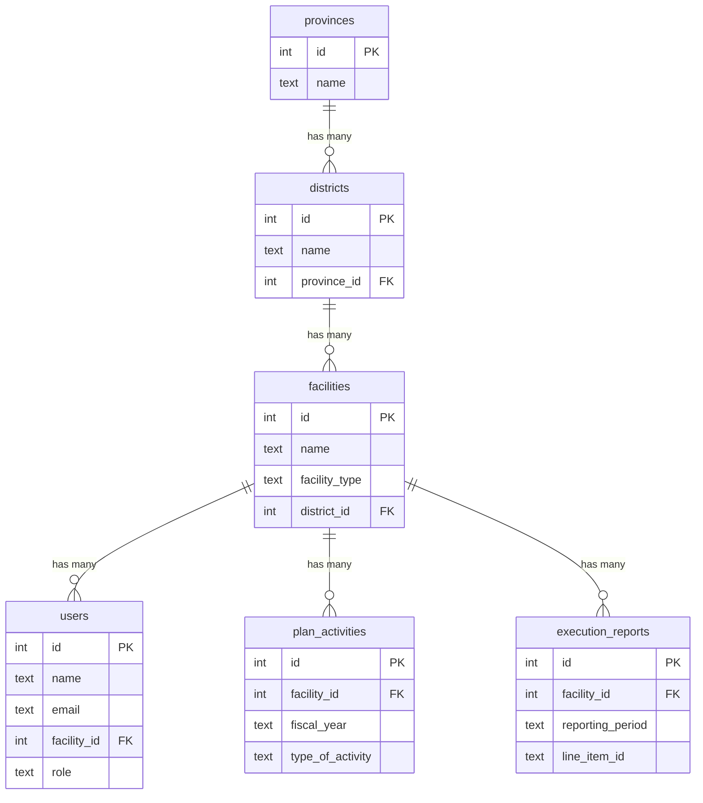

# Normalized Database Schema

This document outlines a normalized database schema for PostgreSQL. This design evolves from the previous simplified versions by introducing dedicated tables for `provinces`, `districts`, and `facilities`. This approach establishes a single source of truth for location and facility data, ensuring data integrity and reducing redundancy.

## Design Philosophy

The core of this design is normalization. Instead of storing facility and location names as plain text in multiple tables, we create dedicated tables for each entity and use foreign keys to link them.

-   `provinces` -> `districts` -> `facilities`
-   The `plan_activities`, `execution_reports`, and `users` tables will now reference a single `facility_id` instead of storing multiple text fields for location.

This provides significant benefits:
-   **Data Integrity**: Prevents spelling mistakes and ensures that all parts of the application refer to the same, official facility record.
-   **Efficiency**: Reduces the amount of repeated data stored in the database.
-   **Maintainability**: If a facility's details change, the update only needs to happen in one place.

## Entity-Relationship Diagram (ERD)



## Normalized Table Definitions

### `provinces`

Stores the unique list of provinces.

```sql
CREATE TABLE provinces (
    id SERIAL PRIMARY KEY,
    name TEXT NOT NULL UNIQUE
);
```

### `districts`

Stores the unique list of districts, each linked to a province.

```sql
CREATE TABLE districts (
    id SERIAL PRIMARY KEY,
    name TEXT NOT NULL UNIQUE,
    province_id INTEGER NOT NULL REFERENCES provinces(id)
);
```

### `facilities`

Stores the master list of all facilities (hospitals and health centers), each linked to a district.

```sql
CREATE TABLE facilities (
    id SERIAL PRIMARY KEY,
    name TEXT NOT NULL,
    facility_type TEXT NOT NULL CHECK (facility_type IN ('hospital', 'health_center')),
    district_id INTEGER NOT NULL REFERENCES districts(id),
    UNIQUE(name, district_id)
);
```

## Updated Table Definitions

The following tables are updated to use a `facility_id` foreign key instead of denormalized text fields.

### `users` (Updated)

```sql
CREATE TABLE users (
    id SERIAL PRIMARY KEY,
    name TEXT NOT NULL,
    email TEXT NOT NULL UNIQUE,
    password_hash TEXT NOT NULL,
    facility_id INTEGER REFERENCES facilities(id), -- Can be NULL if user is not facility-specific (e.g., admin)
    role TEXT NOT NULL DEFAULT 'user' CHECK (role IN ('admin', 'user', 'guest')),
    created_at TIMESTAMPTZ NOT NULL DEFAULT NOW(),
    updated_at TIMESTAMPTZ NOT NULL DEFAULT NOW()
);
```

-   **Removed**: `province`, `district`, `hospital_name`
-   **Added**: `facility_id` as a foreign key to `facilities(id)`.

### `plan_activities` (Updated)

```sql
CREATE TABLE plan_activities (
    id SERIAL PRIMARY KEY,

    -- Foreign Key to link to the facility
    facility_id INTEGER NOT NULL REFERENCES facilities(id),

    -- Plan Information
    fiscal_year TEXT NOT NULL,
    project TEXT NOT NULL DEFAULT 'HIV NSP BUDGET SUPPORT',
    plan_last_modified TIMESTAMPTZ NOT NULL DEFAULT NOW(),

    -- Activity Information
    activity_category TEXT NOT NULL,
    type_of_activity TEXT NOT NULL,
    activity_description TEXT,

    -- Costing and Counts
    frequency NUMERIC(10, 2) NOT NULL,
    unit_cost DECIMAL(18, 2) NOT NULL,
    count_q1 INTEGER DEFAULT 0,
    count_q2 INTEGER DEFAULT 0,
    count_q3 INTEGER DEFAULT 0,
    count_q4 INTEGER DEFAULT 0,

    -- Generated Amounts
    amount_q1 DECIMAL(18, 2) GENERATED ALWAYS AS (frequency * unit_cost * count_q1) STORED,
    amount_q2 DECIMAL(18, 2) GENERATED ALWAYS AS (frequency * unit_cost * count_q2) STORED,
    amount_q3 DECIMAL(18, 2) GENERATED ALWAYS AS (frequency * unit_cost * count_q3) STORED,
    amount_q4 DECIMAL(18, 2) GENERATED ALWAYS AS (frequency * unit_cost * count_q4) STORED,
    total_budget DECIMAL(18, 2) GENERATED ALWAYS AS ((frequency * unit_cost * count_q1) + (frequency * unit_cost * count_q2) + (frequency * unit_cost * count_q3) + (frequency * unit_cost * count_q4)) STORED,

    comment TEXT,

    -- A single facility can only have one plan entry per activity type per year
    UNIQUE(facility_id, fiscal_year, project, type_of_activity)
);
```

-   **Removed**: `facility_name`, `facility_district`, `facility_type`
-   **Added**: `facility_id` as a foreign key. The facility's type can be retrieved by joining with the `facilities` table.

### `execution_reports` (Updated)

```sql
CREATE TABLE execution_reports (
    id SERIAL PRIMARY KEY,

    -- Foreign Key to link to the facility
    facility_id INTEGER NOT NULL REFERENCES facilities(id),
    
    -- Report Information
    fiscal_year TEXT NOT NULL,
    reporting_period TEXT NOT NULL,
    project TEXT NOT NULL,
    report_last_modified TIMESTAMPTZ NOT NULL DEFAULT NOW(),

    -- Financial Row Information
    line_item_id TEXT NOT NULL,

    -- Quarterly Amounts (Actuals)
    q1_amount DECIMAL(18, 2),
    q2_amount DECIMAL(18, 2),
    q3_amount DECIMAL(18, 2),
    q4_amount DECIMAL(18, 2),

    -- Cumulative balance and comments
    cumulative_balance DECIMAL(18, 2),
    comments TEXT,
    
    -- A single facility can only have one entry per line item per reporting period
    UNIQUE(facility_id, fiscal_year, project, reporting_period, line_item_id)
);
```
-   **Removed**: `facility_name`, `facility_district`, `facility_type`
-   **Added**: `facility_id` as a foreign key.

### `execution_reports`

Based on the analysis of `execution-form-schema.ts`, the execution data has a different structure from the planning data. It captures financial report line items rather than operational activities. This table stores each of those line items.

```sql
CREATE TABLE execution_reports (
    id SERIAL PRIMARY KEY,

    -- Report Information (Repeated for each row)
    facility_name TEXT NOT NULL,
    facility_district TEXT NOT NULL,
    facility_type TEXT NOT NULL CHECK (facility_type IN ('hospital', 'health_center')),
    fiscal_year TEXT NOT NULL,
    reporting_period TEXT NOT NULL, -- e.g., 'JULY - SEPTEMBER / 2023'
    project TEXT NOT NULL,
    report_last_modified TIMESTAMPTZ NOT NULL DEFAULT NOW(),

    -- Financial Row Information (from financialRowSchema)
    activity_category TEXT NOT NULL,
    type_of_activity TEXT NOT NULL,
    activity_description TEXT,

    -- Quarterly Amounts (Actuals)
    q1_amount DECIMAL(18, 2),
    q2_amount DECIMAL(18, 2),
    q3_amount DECIMAL(18, 2),
    q4_amount DECIMAL(18, 2),

    -- Cumulative balance and comments
    cumulative_balance DECIMAL(18, 2),
    comments TEXT,

    -- Unique constraint for a given facility's report
    UNIQUE(facility_name, fiscal_year, project, reporting_period, line_item_id)
);
```

## Further Column Explanations

-   `execution_reports`: This table is structured to hold the hierarchical financial data defined in the execution form. It does not use generated columns because the logic (e.g., `Surplus = Receipts - Expenditures`) is handled in the frontend code (`calculateHierarchicalTotals` function) before submission. The database will store the final, calculated values provided by the application.
-   `line_item_id`: Corresponds to the `id` in the `FinancialRow` type (e.g., 'a', 'b01'), linking the data back to the frontend template structure. The database only needs to store this key; all other structural information like the title or editable state is managed by the frontend application code.
-   `reporting_period`: A new field specific to execution that captures the exact quarter being reported on.
-   `UNIQUE(...)`: This comprehensive constraint ensures that for any given facility's report in a specific period, a line item cannot be entered more than once.

### `users`

This table stores user account information based on the fields from the signup form.

```sql
CREATE TABLE users (
    id SERIAL PRIMARY KEY,
    name TEXT NOT NULL,
    email TEXT NOT NULL UNIQUE,
    password_hash TEXT NOT NULL,
    province TEXT,
    district TEXT,
    hospital_name TEXT,
    role TEXT NOT NULL DEFAULT 'user' CHECK (role IN ('admin', 'user', 'guest')),
    created_at TIMESTAMPTZ NOT NULL DEFAULT NOW(),
    updated_at TIMESTAMPTZ NOT NULL DEFAULT NOW()
);
```

## User Table Column Explanations

-   `name`, `email`, `province`, `district`, `hospital_name`: These fields directly map to the user input fields on the signup form. The `email` is marked as `UNIQUE` to ensure no two users can register with the same email address.
-   `password_hash`: For security, we never store plain-text passwords. This column will store a securely hashed version of the user's password.
-   `role`: A role for the user, which will be crucial for handling permissions and access control within the application. It defaults to `'user'`.
-   `created_at`, `updated_at`: Timestamps to track when a user account is created or modified. 

```sql
CREATE TABLE provinces (
    id SERIAL PRIMARY KEY,
    name TEXT NOT NULL UNIQUE
);

CREATE TABLE districts (
    id SERIAL PRIMARY KEY,
    name TEXT NOT NULL UNIQUE,
    province_id INTEGER NOT NULL REFERENCES provinces(id)
);

CREATE TABLE facilities (
    id SERIAL PRIMARY KEY,
    name TEXT NOT NULL,
    facility_type TEXT NOT NULL CHECK (facility_type IN ('hospital', 'health_center')),
    district_id INTEGER NOT NULL REFERENCES districts(id),
    UNIQUE(name, district_id)
);

```